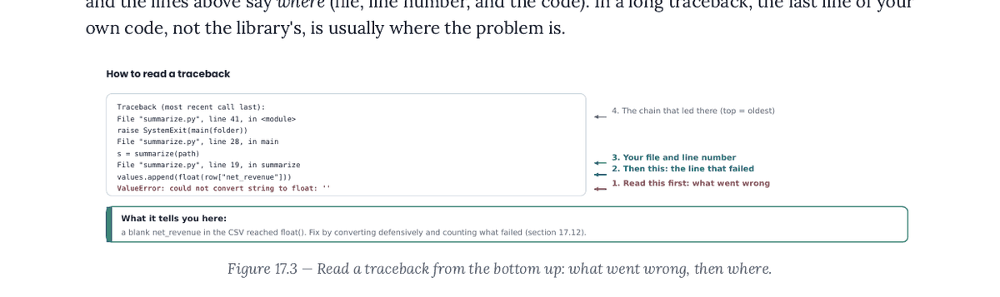
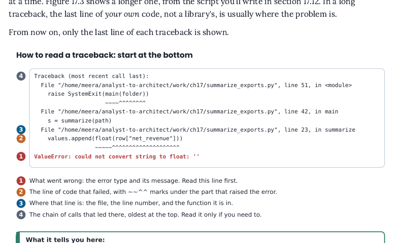
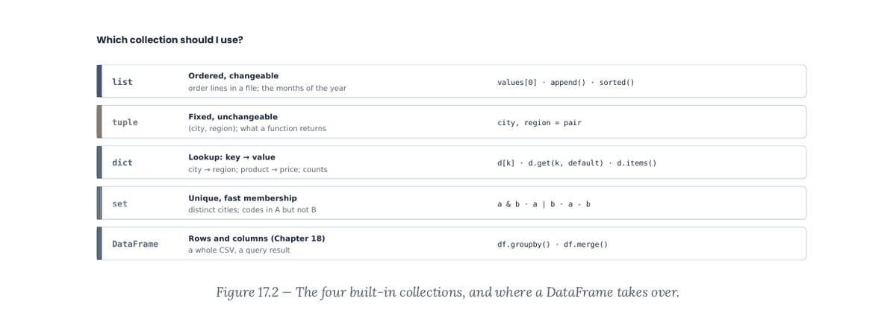
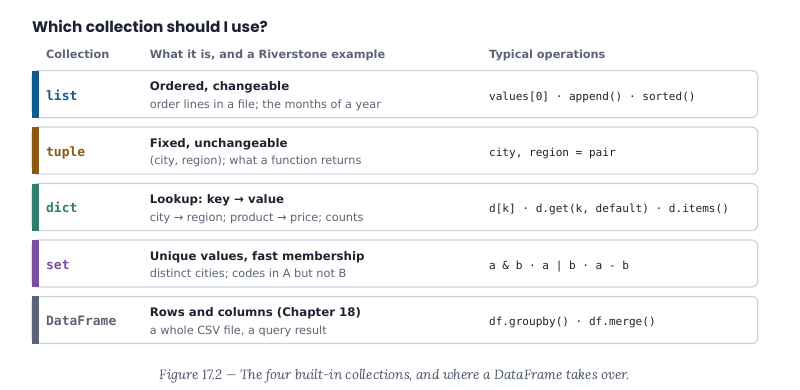
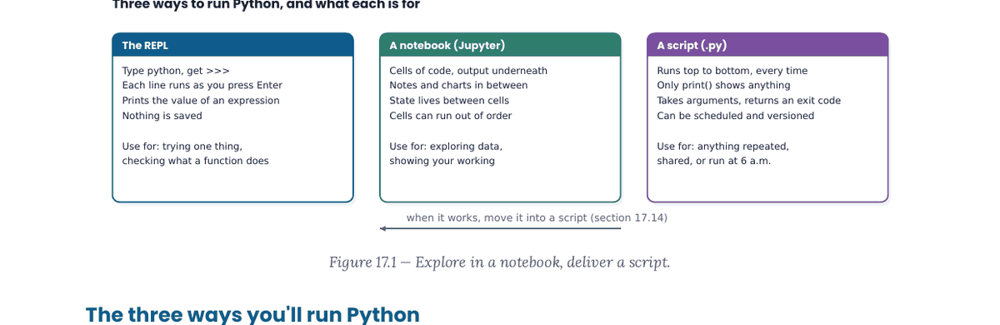
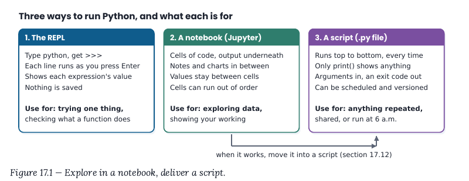

# Chapter 17 changelog: Python from Zero

Parts 2 and 3 build, 28 Sep 2026. One line per finding: `ID · what changed · where · option`. Section numbers are the new ones: old §17.2–17.3 were absorbed into the new §17.0, so old §17.4–17.15 are now §17.2–17.13, with Loops (now §17.6) moved before Dictionaries (now §17.7). Status in brackets.

- **17.1** · New §17.0 'Setting up Python, the terminal and Jupyter' (terminal minimum, install Python/VS Code, .venv, JupyterLab, check_setup.py OK + failure run, first notebook, troubleshooting table); old §17.2-17.3 merged into it and removed; 'Chapter 6 set up the toolkit' gone; Before you start rewritten. Terminal sessions pass verify_shell; notebook outputs from a real kernel (checks/ch17_check.py). · §17.0, Before you start [Verified]
- **17.2** · §17.2 REPL shown as a real >>> session (captured through a pseudo-terminal, Python 3.14.7) with 22; >>> and exit() explained; order of operations in §17.0 step 6. · §17.2 [Verified]
- **17.3** · §17.0 step 4 Watch out: execution policy, Set-ExecutionPolicy -ExecutionPolicy RemoteSigned -Scope CurrentUser (Python venv docs), activate.bat alternative, (.venv) PS prompt. · §17.0 step 4 [Verified]
- **17.4** · One command per step with real output (verify_shell): cd, python3 -m venv .venv, ls -a, source activate, python --version, pip install (real, trimmed), pip freeze > requirements.txt (> explained, file lines shown), deactivate; -m explained. · §17.0 step 4 [Verified]
- **17.5** · Example package is jupyterlab (needed now); pandas left to Ch 18. · §17.0 step 4 [Verified]
- **17.6** · §17.2 is print() only; hello.py moved after variables in §17.3 as cells (variable, orders/12, f-string :.1f explained part by part) with '# hello.py: my first script' comment line. · §17.2, §17.3 [Verified]
- **17.7** · Types cell with type() per value; separate cells for arithmetic, method (defined: function that belongs to a value, called with a dot), not. · §17.3 [Verified]
- **17.8** · Strings in four cells (strip+len, title+chaining, replace/startswith/in, split/join); TRIM analogy corrected. · §17.3 Strings [Verified]
- **17.9** · Three assignment lines; arithmetic, // % ** and conversions in separate cells; + on strings introduced before str(net) + ' rupees'. · §17.3 Numbers [Verified]
- **17.10** · Lists in eight cells with an index table (0..3 / -4..-1), slice worked by hand, sorted vs sort() returning None. · §17.4 [Verified]
- **17.11** · ranked = sorted(..., reverse=True) then ranked[:3]; named option explained with pointer to §17.8. · §17.4 [Verified]
- **17.12** · Option (a): Loops moved before Dictionaries (new order 17.4 lists, 17.5 conditions, 17.6 loops, 17.7 dicts); :<10 explained. · §17.5–17.7 order · option (a), move Loops before Dictionaries [Verified]
- **17.13** · += explained at first use with a three-row trace table. · §17.6 [Verified]
- **17.14** · for / enumerate / zip in three cells. · §17.6 [Verified]
- **17.15** · Option (a): note that 10.805 is stored as 10.80499999… (checked: format(10.805,'.20f')). · §17.6 · option (a), add the float note [Verified]
- **17.16** · while...else removed; break/continue explained in one line each. · §17.6 [Verified]
- **17.17** · Loop version first with the same output, then the comprehension; reading order middle, right, left. · §17.6 [Verified]
- **17.18** · Option (a): net_revenue = 284530.75 -> '284,531 is above target'; ',' separator explained, with a note on Indian grouping in text vs Python output. · §17.5 · option (a), use 284,530.75 [Verified]
- **17.19** · Split into and / is None + truthiness table / conditional expression cells. · §17.5 [Verified]
- **17.20** · §17.9 opens with 'Where your code is running' and a Path.cwd() cell; §17.0 sets work/ch17 as the working folder. · §17.9 [Verified]
- **17.21** · Paths in seven cells (import, exists/is_dir, glob with *, name/stem/suffix as attributes vs methods, stat().st_size, comprehension, folder / 'file' with output). · §17.9 [Verified]
- **17.22** · read_text/splitlines (\n explained), write with 'with' explained part by part, read back with enumerate/strip; modes list fixed (newline='' is an argument, not a mode). · §17.9 [Verified]
- **17.23** · DictReader + len; first row shown key by key; type() of a value is str; sorted-keys line dropped. · §17.9 [Verified]
- **17.24** · Dictionary comprehension taught in §17.7 (loop first, then one-liner); §17.9 builds by_name with the loop, then the comprehension. · §17.7, §17.9 [Verified]
- **17.25** · start=2 explained; repr() mini cell before the loop; unused import removed; split into bad_rows cell and report cell. · §17.10 [Verified]
- **17.26** · Logging block moved out with finding 17.39 (manuscript/_parked/ch17-moved-out.md Block 1 -> Ch 20), with the output problem and the fix written into the park note. Ch 17 keeps one sentence. · old §17.14 → parked for Ch 20 [Fixed]
- **17.27** · summary_script string, write_text and subprocess cells deleted; §17.12 builds summarize_exports.py in VS Code in four stages, each run in the terminal with real output (checks/ch17_check.py); exit codes shown with echo $? (and $LASTEXITCODE for PowerShell); 'also written by the chapter's own code' gone from Tools. · §17.12 [Verified]
- **17.28** · show_args.py mini script with sys.argv output; raise SystemExit, __name__, the conditional default, KeyError/TypeError/ValueError reasons, and a format-spec table explained. · §17.12 [Verified]
- **17.29** · Option (a): 13 files, one per branch per month for the quarter plus one more; 'Thirty-six files' sentence rewritten. · In the real world · option (a), 12 files plus a thirteenth [Verified]
- **17.30** · One story: Mumbai_2025_09 (1).csv, exact duplicate of September's 412 rows, ₹1.4 crore, quarter ₹1.4 crore less than Finance's estimate. · In the real world · the finding's one story [Verified]
- **17.31** · Held by the register (renumbering: Python as Software becomes Chapter 30; recommend Reject). Both 'Chapter 30' references left unchanged. · Where this leads, project stretch [Open]
- **17.32** · Parts 3 to 5 with analytics, data-science and data-engineering; table row '(Chapters 21–22, 30–31, and Part 4)'. · Why this matters, §17.1 [Verified]
- **17.33** · Recommend Python 3.14 (3.14.7, 5 Aug 2026; 3.15.0 due 1 Oct 2026: PEP 745 and PEP 790, python/peps on GitHub, read 28 Sep 2026); chapter re-run on 3.14.7 and 3.11.15, 0 mismatches on both; 'any Python from 3.11 on' stated once in §17.0. · §17.0 step 2, Tools [Verified]
- **17.34** · build_ch17_files.py removed from reader text (at-a-glance and Tools); the builder's own docstring documents it for maintainers. · At a glance, Tools [Verified]
- **17.35** · '(In the finished book these move to Appendix G.)' deleted. · Answers [Verified]
- **17.36** · Symptom now 'SyntaxError: invalid syntax (Python often suggests "Maybe you meant '=='")'. · Common mistakes [Verified]
- **17.37** · Full Jupyter traceback shown once (real nbclient run, Cell In[1]), then 'From now on, only the last line of each traceback is shown'. · §17.10 [Verified]
- **17.38** · Figure 17.3 box says '(see “Handling errors on purpose”, below)'. · Figure 17.3 [Verified]
- **17.39** · Six 'Stop here: sitting n of 6' markers; stdlib cells split; stdev pointed to Ch 21; logging, argparse (stretch 23-24, project stretch, argparse clause) parked for Ch 20; PEP 8/ruff as a Tool note box; logging/argparse removed from Key terms. · whole chapter [Verified]
- **17.40** · Level 5 asks 'How many distinct customers have non-cancelled revenue' (23), checked. · Timed challenge [Verified]
- **17.41** · Shortcuts table in §17.0 step 3: Ctrl+` on all, Cmd+Shift+P on macOS. · §17.0 step 3 [Verified]
- **17.42** · extend() explained against append() in the real-world story. · In the real world [Verified]
- **V17.1** · Figure 17.3 redrawn on a 640 px canvas: min 7.24 pt; traceback full width from a real run with numbered markers and a key below. changelog/img/ch17-V17.1-before/after.png. · figures [Verified] ·  
- **V17.2** · Figure 17.2 redrawn: min 7.24 pt. changelog/img/ch17-V17.2-before/after.png. · figures · option (a), redraw [Verified] ·  
- **V17.3** · Figure 17.1 arrow now runs from the notebook card to the script card. changelog/img/ch17-V17.3-before/after.png. · figures [Verified] ·  
- **V17.4** · Figure 17.1 text min 7.71 pt. · figures [Verified]
- **V17.11** · Traceback keeps its 2- and 4-space indents (indent drawn as an x offset). · figures [Verified]
- **V17.12** · Kept the redrawn figure; the duplicate 'Which one do I use?' table removed. · figures · keep the figure, drop the table [Verified]
- **V17.16** · Appendix G note removed. · figures [Verified]
- **RJ-S2-7** · Ch 17's references that already carry a new number: 'Chapter 30, Python as Software, Not Scripts' (Where this leads) and 'Chapter 30's testing' (project stretch). Left as they are (17.31 held); listed for the final renumbering pass. Other chapters' parts elsewhere. · several chapters [Approved]
- **RJ-S3-18** · Ch 17's part done: one rule in §17.0 step 2 ('Any Python from 3.11 on runs every example in the book; ... checked on 3.14.7 and 3.11.15. Later chapters don't repeat this'). Ch 14, 15, 18, 20-23, 26, 27 still to defer to it. · several chapters [Approved]
- **RJ-S3-31** · Ch 17's part done: exit code defined in §17.12, environment variable defined in §17.11's Watch out. Ch 18, 20, 34 remain. · several chapters [Approved]
- **RJ-S1-5** · Held by the register (assumes Ch 17-18 before 14-16); not touched. · several chapters [Open]
- **RJ-S3-10** · Held by the register; the Ch 17 half (credit Ch 19's VBA variables/loops) not applied. See questions. · several chapters [Open]

## Also changed (forced by the seven tests or the brief)

- Parked blocks landed: Ch 2 Block 1 (0.1 + 0.2 and the exact `Decimal` version, §17.3); Ch 6 §4.3 Step 3 and §4.4 Step 4 (install Python, venv, pip, the PowerShell policy line, VS Code, first `hello.py` idea), the `.venv/` folder line, the locked-laptop / Python install manager clause, `check_setup.py` (rewritten for Ch 17 as `companion/ch17/check_setup.py`), the VS Code shortcuts row, the terminal table (§6.5, the Python minimum), the rounding comparison's Python and spreadsheet parts (`round(2.5)`, `round(2.675, 2)`, the Python documentation quotes, banker's rounding, §17.3), the venv and wrong-folder common-mistakes rows, Meera's setup episode (adapted: the missing package is JupyterLab installed outside `.venv`, since Ch 17 installs only JupyterLab), the RJ-S3-18 version sentence, and old exercises 3, 5, 6(c, d), 7, 11 with answers (now 7, 25, 8, 33, 26). Not landed: exercise 2(c) (a matching exercise across all tools; only its Python part would fit), the recap and check-yourself lines as written (rewritten into Ch 17's own).
- Rupee amounts of ₹1,00,000 or more in the text, tables and answers written in lakh grouping (₹43,35,471.00, ₹42,40,000, ₹6,81,070.75 …); program output left as Python prints it, with one sentence in §17.5 explaining the difference.
- Exercises renumbered: new warm-ups 7–8, old core 7–22 → 9–24, new core 25–26, old stretch 25–27 → 27–29 (old 23–24 parked for Ch 20), old think 28–30 → 30–32, new 33. Exercise 29 now points to exercises 13, 14, 15.
- Real-world story and practice paths use `work/ch17` (the front section's rule: never edit companion files).
- Debugging lead-in reworded so it no longer ends as a stranded lead-in.
- Companion: new `check_setup.py`; `summarize_exports.py` now the finished §17.12 script; verifier by-products (`month_summary.csv`, `price_list.json`, `scratch.txt`) removed from `companion/ch17/`.
- Checks: `checks/ch17_setup_workdir.sh` (builds the reader's folder at /home/meera/analyst-to-architect with Python 3.14 and JupyterLab) and `checks/ch17_check.py` (script stages, show_args, exit codes, REPL, notebook cells, Jupyter traceback, requirements.txt, Figure 17.3's traceback, 20 answer figures).

Sources checked (T13), all read 28 Sep 2026 from the official repositories on GitHub (python.org and docs.python.org are blocked by the proxy): PEP 745 (3.14 schedule: 3.14.7 on 2026-08-05) and PEP 790 (3.15.0 due 2026-10-01), python/peps; CPython 3.14 docs `Doc/using/windows.rst` (Python install manager, `py install`), `Doc/library/venv.rst` (activation commands per shell; `Set-ExecutionPolicy -ExecutionPolicy RemoteSigned -Scope CurrentUser`), `Doc/library/functions.rst` at v3.14.0 (`round()` quotes); microsoft/vscode-docs `docs/datascience/jupyter-notebooks.md` (Select Kernel, Shift+Enter) and `docs/terminal/basics.md`; MicrosoftDocs/PowerShell-Docs `Get-Location.md` (pwd alias), `about_Aliases.md` (ls, cd), `about_Execution_Policies.md` (Restricted default on Windows clients), `about_Automatic_Variables.md` ($LASTEXITCODE). Spreadsheet `ROUND(2.5,0)`=3, `ROUND(2.675,2)`=2.68, `ROUND(4.5,0)`=5 computed in LibreOffice headless.

## Integration (Part 2/3)

- Packages table (Ch 18 agent) · `python-dotenv` chapter 20 → 18 (Ch 18 §18.13 teaches it) · §17.11 · —
- Standard-library table · `logging` "(Chapter 20)" → "(Chapter 18)" (Ch 18 §18.15 teaches it) · §17.11 · —
- Credentials Watch out · ".env file that is never shared (Chapters 20 and 26)" → "(Chapters 18 and 26)" · §17.11 · —
- §17.12 closing paragraph · "Chapter 20 does that with the `logging` module, and adds … `argparse`" → "Chapter 18 does that …; Chapter 20 puts such a script on a schedule." · §17.12 · —
- Where this leads · Ch 18 bullet adds "scripts with logging and command-line options"; Ch 20 bullet now "scheduling scripts, sending email, handling failure, and keeping a log file of every run" (what Ch 20 adds) · Where this leads · —
- Verified: reader folder rebuilt with `checks/ch17_setup_workdir.sh`; `verify_python.py` 85 blocks, 83 outputs, 0 mismatches; `verify_shell.py` 20 commands, 0 mismatches; `checks/ch17_check.py` 0 problems; `restructure.py --check` in order; build 61 pages, layout_check clean (map 20/20).
- RJ-S2-7 (round 3) · "Chapter 30, Python as Software, Not Scripts" (Where this leads) and "Chapter 30's testing" (project stretch) → "Chapter 29": today's file numbers everywhere, so the final renumbering pass maps every reference in one step (a mechanical old→new pass would have turned "Chapter 30" into 33). Rows 17.31/RJ-S3-36 are still held Open; see integration-part3.md · Where this leads, Project · —
- Verified (round 3): `verify_python.py` (reader folder) 85 blocks, 83 outputs, 0 mismatches; `restructure.py --check` in order; build 61 pages, layout_check clean (map 20/20).
