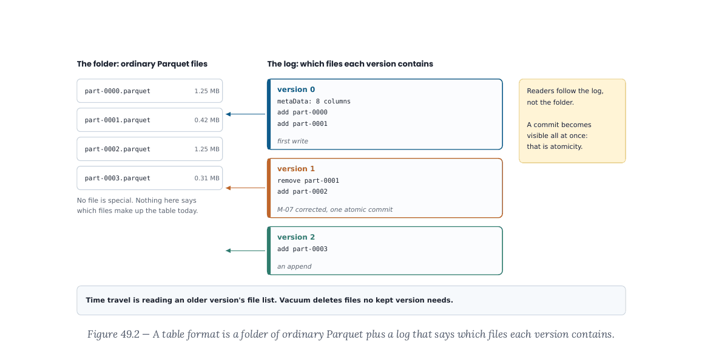
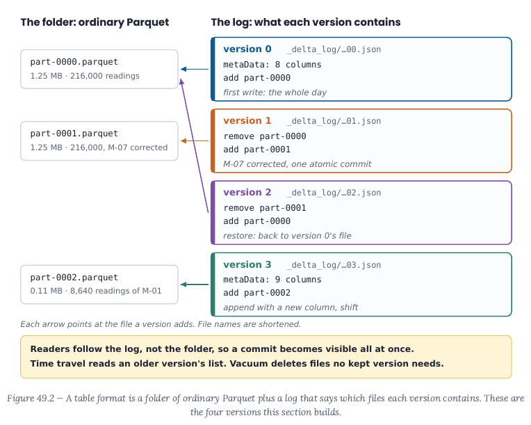

# Chapter 49 changelog: Storage, Warehouses & Lakehouses

Part 5 build, 29 September 2026. One line per finding: `ID · what changed · where · option`. Status in brackets.

- **49.1** [Verified] · §49.8 rewritten: rollout scenario 1,460 sensors x 1/s = 126,144,000 readings a day -> 277 GB a year (Ch 52 unchanged); today 25 machines = 78,840,000 a year, 0.47 GB; arithmetic in a Python cell (verify_python OK); checked in rebuilt PDF and verify_python 0 mismatches · §49.8
- **49.2** [Verified] · $ amounts now plain text (style pass stopped TeX maths); storage $6.37 (not 6.40); Answer 9 rewritten; checked in rebuilt PDF; checked in rebuilt PDF and verify_python 0 mismatches · §49.8, Answer 9
- **49.3** [Verified] · Compaction rewritten: 24 distinct hourly appends; real outputs 24 files avg 0.06 MB, 1.41 MB -> 1 file 0.82 MB (compacted size varies by ~1-2 KB between runs, so the report rounds to 0.01 MB); reading text, Recap, Ex/Ans 7 updated with both reasons (measured column and footer sizes); checked in rebuilt PDF and verify_python 0 mismatches · §49.5 compaction, Recap, Ex/Ans 7
- **49.4** [Verified] · temperature_c explanation fixed (4,729 distinct values, 13-bit codes ~200 KB, printed via stats.distinct_count); Answer 4 fixed; checked in rebuilt PDF and verify_python 0 mismatches · §49.3, Answer 4
- **49.5** [Verified] · Row-group cell prints 0.80 MB before compression and 0.69 MB on disk, with explanation; checked in rebuilt PDF and verify_python 0 mismatches · §49.3 · first option: print on-disk figure (and keep the uncompressed one, relabelled)
- **49.6** [Verified] · New "Two layers of shrinking" hand-worked box (dictionary, run-length, bit-packing; codec Snappy/zstd/gzip defined) before the metadata code; encodings printed; key terms added; checked in rebuilt PDF and verify_python 0 mismatches · §49.3 "Two layers of shrinking"
- **49.7** [Verified] · New subsection "The same test across formats, with timing" in §49.2: time.perf_counter cell (CSV vs Parquet) + five-format table re-measured with new companion format_test.py on the sensor day (the old 500,000-line table could not be reproduced: no such dataset; parked note required a re-run). Parked Ch 2 Block 2 landed (compression/gzip paragraph in §49.3 box; lossless sentence). gzip and codec in Key terms; checked in rebuilt PDF and verify_python 0 mismatches · §49.2 new subsection, §49.3 · deviation: table re-measured on the sensor day (see summary)
- **49.8** [Verified] · New "Object storage in five sentences" (bucket, object, key, whole-object ops, network calls, S3/GCS/Azure Blob, Ch 52); bucket and key added to Key terms; checked in rebuilt PDF and verify_python 0 mismatches · §49.1
- **49.9** [Verified] · §49.4 now says Ch 12 §12.13 Step 8 showed atomicity with BEGIN/COMMIT/ROLLBACK (two open purchase orders); ACID taught here as new; checked in rebuilt PDF and verify_python 0 mismatches · §49.4
- **49.10** [Verified] · Consistency row example replaced (no machine_id / units_made = -3); sentence after the table: table formats give A, I, D and schema enforcement; business rules are Ch 47 tests; Answer 3 fixed; checked in rebuilt PDF and verify_python 0 mismatches · §49.4, Answer 3
- **49.11** [Verified] · "Two writers at once" paragraph (optimistic concurrency) after the Watch out box; Key terms; checked in rebuilt PDF and verify_python 0 mismatches · §49.5
- **49.12** [Verified] · First cell split: §49.0 setup cell (os, duckdb, build, in-memory connect explained), build() cell, size-loop cell with listdir/getsize/1e6/format specs explained; imports moved to first use (sqlite3, time, pyarrow.parquet, shutil/deltalake, json, traceback, pyarrow); checked in rebuilt PDF and verify_python 0 mismatches · §49.0, §49.2
- **49.13** [Verified] · SQLite introduced (single-file row database; sqlite3 module) in its own cell; connect/execute/fetchone()[0]/close and table readings explained; checked in rebuilt PDF and verify_python 0 mismatches · §49.2
- **49.14** [Verified] · Path-as-table and nested quotes explained; SQL that actually runs shown; checked in rebuilt PDF and verify_python 0 mismatches · §49.2
- **49.15** [Verified] · Metadata block split into 4 cells (file level, row group, per-column sizes+encodings, statistics); footer, 122,880 DuckDB row-group size and the conditional explained; checked in rebuilt PDF and verify_python 0 mismatches · §49.3
- **49.16** [Verified] · Row-group knob added (DuckDB ROW_GROUP_SIZE, PyArrow row_group_size); 128 MB ~ 20 million readings at ~6 bytes; checked in rebuilt PDF and verify_python 0 mismatches · §49.3
- **49.17** [Verified] · Codec bullet rewritten (Parquet chunks compressed separately; whole-file gzip is the non-splittable case); checked in rebuilt PDF and verify_python 0 mismatches · §49.3
- **49.18** [Verified] · Sorted-by-machine observation added (row group 0 M-01..M-15, row group 1 M-15..M-25; shuffled -> no skipping); checked in rebuilt PDF and verify_python 0 mismatches · §49.3
- **49.19** [Verified] · Create-table code split into 3 cells: Arrow table (.arrow().read_all()), write_deltalake + folder listing, DeltaTable + register (snapshot, re-register); shutil.rmtree explained; checked in rebuilt PDF and verify_python 0 mismatches · §49.5 Creating a table
- **49.20** [Verified] · Raw log shown first (4 actions, protocol line printed whole); loop simplified (list(action)[0]); JSON-inside-JSON explained; checked in rebuilt PDF and verify_python 0 mismatches · §49.5 What's in the log
- **49.21** [Verified] · Checked: source had M-07 (hyphen lost in extraction); queries now kept on single-line strings / a variable m07_avg; checked in rebuilt PDF and verify_python 0 mismatches · §49.5
- **49.22** [Verified] · Correction split into 4 cells: before, corrected (* REPLACE explained, 8,640 rows), predicate write (explained), checks; checked in rebuilt PDF and verify_python 0 mismatches · §49.5 An atomic correction
- **49.23** [Verified] · New "Restoring a version" cell (restore(0) -> version 2, M-07 back to 196.0) and "Vacuum" cells (dry_run -> [], retention_hours=1 refused; enforce_retention_duration explained); project steps 5 and 8 updated; checked in rebuilt PDF and verify_python 0 mismatches · §49.5 Restoring a version, Vacuum; Project
- **49.24** [Verified] · Schema cells: without merge (SchemaMismatchError shown), with schema_mode="merge", and GROUP BY shift showing (None, 216000); checked in rebuilt PDF and verify_python 0 mismatches · §49.5 Schema changes
- **49.25** [Verified] · file_report reads sizes from get_add_actions (pa.table(...).column("size_bytes")); old code actually failed here (URL-encoded path); checked in rebuilt PDF and verify_python 0 mismatches · §49.5 compaction · first option: get_add_actions
- **49.26** [Verified] · "1 file" singular via conditional expression; checked in rebuilt PDF and verify_python 0 mismatches · §49.5 compaction · first option: singular/plural in the f-string
- **49.27** [Verified] · Figure 49.2 redrawn to match the code: v0 add part-0000; v1 remove 0000 add 0001; v2 restore; v3 add 0002 (new column); checked in rebuilt PDF and verify_python 0 mismatches · Figure 49.2 · first option: redraw
- **49.28** [Verified] · Partitioned write cell added at end of §49.6 (CAST(reading_ts AS DATE), partition_by, folder listing); checked in rebuilt PDF and verify_python 0 mismatches · §49.6
- **49.29** [Verified] · §49.6 rule for small tables (month for Riverstone); §49.9 recommendation, Answer 10 rewritten with sizes (2.1 MB/day, 62 MB/month, 3.8 GB/5 yr), project step 2 uses month; checked in rebuilt PDF and verify_python 0 mismatches · §49.6, §49.9, Answer 10, Project step 2
- **49.30** [Verified] · Plain-words glosses under the warehouse table (virtual warehouse, auto-suspend, slot, micro-partitions, clustering keys, sort keys, distribution styles, WLM, node-hour, RPU); compute linked to DuckDB in §49.2; Ch 65 pointer; checked in rebuilt PDF and verify_python 0 mismatches · §49.7 · first option: glosses under the table
- **49.31** [Verified] · Where this leads: Ch 62 Data Architecture Patterns + Ch 65 FinOps; Ch 52 line ~825 fix listed for integrator; checked in rebuilt PDF and verify_python 0 mismatches · Where this leads
- **49.32** [Verified] · Simplification note: Ch 52 adds compute, Ch 65 covers cost management; checked in rebuilt PDF and verify_python 0 mismatches · §49.8 note
- **49.33** [Verified] · Option (a): $6.25 per TiB (BigQuery on-demand, cloud.google.com/bigquery/pricing, checked 29 Sep 2026); S3 Standard $0.023/GB-month us-east-1 first 50 TB (AWS Price List API, published 28 Sep 2026); recomputed in a code cell: $0.030 vs $1.58 a run, ratio 52; Ex/Ans 9 updated ($47.26 vs $0.91 a month); checked in rebuilt PDF and verify_python 0 mismatches · §49.8, Ex/Ans 9 · option (a): $6.25 per TiB, recomputed
- **49.34** [Verified] · Appendix G sentence deleted; checked in rebuilt PDF and verify_python 0 mismatches · Answers
- **49.35** [Verified] · Option (a): new "Iceberg in one page" at end of §49.5 (data files, manifests, manifest list, snapshot, metadata file, catalog, hidden partitioning, column ids); Ex 12 reworded to use it; Answer 12 rewritten from chapter content; checked in rebuilt PDF and verify_python 0 mismatches · §49.5 Iceberg in one page, Ex/Ans 12 · option (a): half-page "Iceberg in one page"
- **49.36** [Verified] · "Rust" dropped; "no Spark and no Java, unlike Chapter 48"; checked in rebuilt PDF and verify_python 0 mismatches · §49.5, §49.0
- **49.37** [Verified] · Figure 49.1 redrawn: short labels with a key, full names in the columnar part; checked in rebuilt PDF and verify_python 0 mismatches · Figure 49.1
- **49.38** [Verified] · One install line in §49.0 (python -m pip install deltalake==1.6.6 in the Ch 17 venv), same in glance/Tools; duckdb>=1.4 noted; checked in rebuilt PDF and verify_python 0 mismatches · Glance, §49.0, Tools
- **V49.3** [Verified] · Figure 49.2 arrows now point at the file each version adds; before/after crops changelog/img/ch49-V49.3-*.png; checked in rebuilt PDF · Figure 49.2 (p. 14 of the new PDF) · before/after:  
- **V49.4** [Verified] · Figure 49.1 redrawn on a 760 px canvas: min 7.46 pt (fig_check); checked in rebuilt PDF · Figure 49.1 (p. 6)
- **V49.5** [Verified] · Figure 49.2 redrawn: min 7.46 pt (fig_check); checked in rebuilt PDF · Figure 49.2
- **V49.15** [Verified] · Conclusions marked with a cross/tick icon and words ("reads every box" / "reads one stripe"), not colour only; checked in rebuilt PDF · Figure 49.1
- **V49.18** [Verified] · Appendix G note removed; checked in rebuilt PDF · Answers
- **RJ-S2-18** [Open] · Ch 49 part (undated "One Tuesday" story, unnamed "data engineer") needs the book calendar/cast from the unapproved Riverstone fact sheet; not touched · In the real world

Rows already done by the style pass (V49.1, V49.2, V49.6–V49.14, V49.16, V49.17) were re-checked in the rebuilt PDF: layout_check clean, no TeX-maths garbling, code wraps with continuation marks.
- Integration (from Ch 49): Chapter 17 §17.11 package table lists `deltalake` (Chapter 49).
