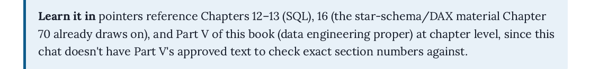
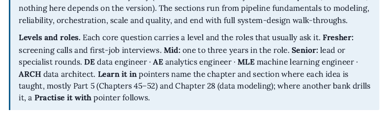

# Ch 77 changelog: Data Engineering & Data System Design Bank

Option picks: 77.4 offers (a) teach topological sort here in short cells or (b) add a box to Ch 33/46; none is marked recommended, so **(a)** was used. 77.16 offers (a) a two-sentence junk-dimension note in Ch 28 §28.9 or (b) mark "Beyond the book"; none recommended, so **(a)**: the note is handed to the integrator (Ch 28 is outside this chapter's files) and Q77-017 points to it. Every other row has one prescribed fix.

Bank format brought in line with Ch 70, 72A and 76A (consistency, test 5): "Chapter at a glance" box, Level (Fresher/Mid/Senior) and Roles (DE, AE, MLE, ARCH) on every core question, a "Roles:" line and a fifth "Level · learn it in" column in every rapid-fire table, and Ch 69's twelve tags written **[+Tag]** ([Structure] → [+Signpost]; [Depth] → [+Signpost] in Q77-008/033 and [+Scale] in Q77-035, where the move is Move 9; [Real evidence] → [+Evidence]; "[Learn it in]" used as a tag → moved to the Learn column and replaced by a real extra point in Q77-003, 011, 014, 019, 025, 026). Question IDs Q77-001…035 are unchanged (Ch 78, 79, 80 and 82 cite them).

- 77.1 · Header paragraph "…since this chat doesn't have Part 5's approved text…" deleted; replaced with "Learn it in pointers name the chapter and section where each idea is taught, mostly Part 5 (Chapters 45–52) and Chapter 28 (data modeling)" inside the glance box · opening
- 77.2 · Q77-001 → Ch 32 §32.1, Ch 45 §45.1 (reverse ETL: Ch 51); Q77-002 → Ch 50 §50.1, §50.8; Q77-007 → Ch 12 §12.13 step 7, Ch 45 §45.5, Ch 46 §46.4 (Ch 45's sections shifted by one since the review: upserts are now §45.5); Q77-008 → Ch 50 §50.3, Ch 51 §51.4; Q77-028 → Ch 47 §47.2–47.3 and §47.5, Ch 14 §14.10, see-also Ch 36 §36.8 · §77.1, 77.2, 77.6
- 77.3 · Q77-013 Learn it in → Ch 28 §28.9–28.10, Ch 32 §32.9 · §77.3
- 77.4 · Topological sort taught in Q77-018 in seven short cells (the DAG, in-degree, children map, the ready queue, Kahn's loop, `topo_order()` with a cycle check, a deliberate cycle), each run with its real output; terms topological sort, Kahn's algorithm, in-degree defined; `deque`/`popleft` tied to Ch 33 §33.4; pointer → Ch 46 §46.2, Ch 33 §33.4 and §33.6 (graphs are §33.6 now, not §33.4), practise Q72A-028. "Chapter 72A (topological concepts…)" removed · §77.4 · option (a)
- 77.5 · The full algorithm is shown and called; `print(topo_order(dag) == order)` → True; prose explains that the order comes from dict insertion order plus the FIFO queue, and that `extract_customers` first is equally valid · §77.4
- 77.6 · Upsert split into cells: `CREATE TABLE daily_summary (order_date DATE PRIMARY KEY, …)`, the upsert + `SELECT *`, the identical re-run + `SELECT COUNT(*)` (real psql output `count / 1`), a what-if cell without the key showing the real ERROR, then cleanup; `ON CONFLICT` and `EXCLUDED` explained; Strong tier adds "the upsert needs a unique key on the business key". Value changed from an invented 10000 to ₹20,900, Riverstone's real net revenue on 5 January 2025 (checks/ch77_check.py) · §77.2 Q77-007
- 77.7 · SCD example rebuilt on the real change in `riverstone_2025.customer_changes` (Harbour Traders, customer 11, Retail → Wholesale on 2025-09-01, signed up 2025-04-09) instead of an invented Sharma Hardware change: `CREATE TABLE customer_history` with `customer_key … GENERATED ALWAYS AS IDENTITY PRIMARY KEY` (Ch 28 §28.10 now uses IDENTITY, not SERIAL), `BEGIN … COMMIT`, half-open `valid_to = '2025-09-01'`, the "valid_to is the first day the row is no longer true" line, output with customer_key 1 and 2, plus a cell proving 31 Aug → Retail and 1 Sep → Wholesale (no gap). Ch 28's own example (the flag to the Part 3 review) already closes on 2026-04-01, so nothing to pass on · §77.3 Q77-013
- 77.8 · Q77-003 → "49.1, 49.5, 49.7; star schema 28.9" · §77.1 rapid-fire
- 77.9 · Q77-014 → "28.9, 16.3 (practise: 70.7)" · §77.3 rapid-fire
- 77.10 · Q77-035 → Ch 14 §14.4, Ch 71 **Q71-041** (Ch 71 was renumbered after the review: exact duplicates are now Q71-041, not Q71-027/023), Ch 33 §33.1, Q72A-002; "(the same match-key idea as Chapter 14's)" added next to blocking · §77.7
- 77.11 · Q77-026 → "49.2 (see also Q71-015, `SELECT *` with `GROUP BY`)" (Q71-053 → Q71-015 after Ch 71's renumbering) · §77.5 rapid-fire
- 77.12 · Q77-023 pointer → Ch 49 §49.6, Ch 48 §48.5, Ch 28 §28.5, practise Ch 71 §71.9 (was §71.10); three bullet lines explain `PARTITION BY RANGE`, `PARTITION OF … FOR VALUES FROM (a) TO (b)` (a included, b excluded) and routing on INSERT; CREATE statements broken at clause boundaries · §77.5
- 77.13 · The 1,000-row loads are shown (`INSERT … SELECT … FROM generate_series(1, 1000)`, explained), routing proved with a count per partition, `ANALYZE` then the real post-ANALYZE plan (`cost=0.00..19.50 rows=32 width=17`; the review's width=10 differs because the id column is now an IDENTITY integer and payloads are "event n"), the "numbers in brackets are estimates" line, and a what-if plan without the partition key (`Append` over both partitions) · §77.5
- 77.14 · Extra point now "`ALTER TABLE events_partitioned DETACH PARTITION events_2025_01` (then archive it, or `DROP TABLE`)" · §77.5
- 77.15 · Q77-024 rewritten: table partitioning inside one database vs sharding across servers, with the Spark/Kafka note; learn → 61.5 (Ch 61 §61.5 draws exactly this line), 48.2, 50.2 · §77.5 rapid-fire
- 77.16 · Q77-017 gains a Riverstone example (order status + a yes/no "discounted" flag) and points to "28.9 (junk dimensions)"; the two-sentence note for Ch 28 §28.9 is in questions-ch77.md "For the integrator" · §77.3 rapid-fire · option (a)
- 77.17 · Q77-022 answer adds the Kafka/consumer-lag sentence; learn → 50.2, 50.7 · §77.4 rapid-fire
- 77.18 · Q77-020 answer now bridges Airflow's waiting sensor and Dagster's watching sensor (Ch 46 §46.6); learn → 46.2, 46.6, 46.8 · §77.4 rapid-fire
- 77.19 · Q77-019 → "46.2 (practise: Q72A-028)"; new extra point on accidental cycles, tied to Q77-018's `topo_order` · §77.4 rapid-fire
- 77.20 · Every rapid-fire row now has a pointer in the new "Level · learn it in" column: Q77-004 47.7; 005 45.3–45.4; 006 45.6; 009 45.8 (+47.7); 010 46.5; 011 45.4–45.6; 012 50.7; 021 46.10, 61.6–61.7; 025 28.11 (practise Q71-049, Q71-055; the review's Q71-069/073 were renumbered); 027 49.2–49.3; 029 47.5; 030 47.6; 031 47.5; 032 47.9, 20.8 · all rapid-fire tables
- 77.21 · Q77-031 retitled "Why does a monitoring setup need a heartbeat, an alert when a pipeline or monitor has gone silent, and not just failure alerts?"; answer names "heartbeat (or dead-man's switch)"; extra point ties it to Ch 47's previous-working-day freshness check · §77.6 rapid-fire
- 77.22 · Passes rows rewritten as partly-right answers: Q77-008 "Defines at-least-once and at-most-once correctly, but treats exactly-once as a setting you switch on"; Q77-028 "Names one sensible check (e.g. no negative revenue) but runs it by hand, after the fact" · §77.2, §77.6
- 77.23 · Q77-008 extra point "**[+Trade-offs]** the other route, used by Spark checkpoints and Kafka transactions (Chapter 50, §50.3), commits the output and the read position together in one transaction" (tag [+Trade-offs]: [Depth] is not one of Ch 69's tags) · §77.2
- 77.24 · "(a watermark)" added; pointer → Ch 50 §50.5 and §50.8 plus §77.1–77.2. Title "Riverstone's warehouse equipment" → "Riverstone's plant machines", to match the case it retells (Ch 50 §50.8, Ch 48's machine sensors) · §77.7 Q77-034
- 77.25 · Q77-033 pointer → Ch 46 §46.3–46.7, Ch 47 §47.4, this chapter's §77.1–77.6; "write–audit–publish" named in the design ("run automatically on the new data before anyone can read it, and only then published") · §77.7
- 77.26 · "Same format as Chapters 70–76" → "Same format as the other question banks in Part 8 (Chapters 70 onward)". Ch 78 ("70–77") and Ch 79 ("70–78") are their own chapters' fixes · opening
- 77.27 · The header no longer claims Chapters 12–13 and 16; see 77.1 · opening
- 77.28 · "Before you start" line added to the glance box (Ch 69; Part 5; Ch 28; Ch 12 §12.13; Ch 33; Ch 61; Ch 71; Ch 72A), with a "Time needed" line · opening
- 77.29 · Q77-028 extra point "**[+Edge cases]** computes the baseline from days that passed their checks, or uses the same weekday over the last four weeks…"; pointer adds Ch 47 §47.5's "don't learn your baseline from broken days" · §77.6
- V77.1 · Drafting note removed (see 77.1). Before/after:   · opening
- V77.2, V77.5, V77.6, V77.7, V77.8 · already Verified by the style pass; still clean in the rebuilt PDF (layout_check: no stranded heads or lead-ins, contents/map numbers 10/10)
- V77.3 · SQL now written with clause breaks; no line wraps to column 0 in the rebuilt PDF · §77.2, 77.3, 77.5
- V77.4, V77.12 · Q-IDs stay on one line in every table and in the final-week list (checked in the rebuilt PDF)
- V77.9 · The Common-mistakes table now splits 4 + 3 rows across pp. 22–23 (the style pass allows long tables to split; no single stranded row)
- V77.10 · DETACH/DROP inline code in the Q77-023 tier table doesn't break mid-token; no stray space before ";" in body text
- V77.11 · Every "Learn it in" line names a chapter and section (see 77.2, 77.20) · all sections
- V77.13 · Python input blocks carry the blue input rule (checked on the topological-sort pages)

Time needed: new line "3–4 hours for a first pass (about 10 minutes per core question, including running its code, and 1–2 minutes per rapid-fire row), plus 1 hour for the final-week list" (the chapter had none; 11 core questions × ~10 min + 24 rows × ~1.5 min ≈ 2.4 h reading, plus running the 22 SQL/Python cells).

---

# 3 October 2026 · Section 77.8, the predict-the-output round

The fifth bank to the 71.11 standard. Chapter 77 already covers pipeline design — idempotency
(Q77-007), delivery semantics (Q77-008), SCD Type 2 (Q77-013), DAG ordering (Q77-018),
partitioning (Q77-023), quality checks (Q77-028) — so this section takes the smaller, meaner thing
that breaks pipelines that are designed correctly: what the file reader, the type system and the
clock do to rows while nobody is looking.

**Section 77.8, "Predict the output: what happens to rows on the way in."** 5,355 words, 9 core
questions (Q77-036 to 044) and 12 rapid-fire rows (Q77-045 to 056), taking the chapter from 35
questions to 56. Nothing renumbered.

Every question is a load that completes successfully. No exception, no failed task, and the rows
are simply not the source's rows:

| | |
|---|---|
| Q77-036 | Leading zeros stripped from customer codes; the overlap with the originals is the empty set |
| Q77-037 | 9007199254740993 stored as a float becomes ...992, so three ids become two |
| Q77-038 | A region column where `NA` means North America: 2 of 4 rows destroyed, 19 default markers |
| Q77-039 | `split(',')` finds 5 fields where `csv.reader` finds 4 |
| Q77-040 | A watermark with `>=` reloads the boundary row; `>` loses a row that ties on the second |
| Q77-041 | Parquet 3.3× smaller, one column in 5 ms against 325 ms — but *slower* for a full read |
| Q77-042 | 01:30 does not exist in London on 30 March; it happens twice on 26 October |
| Q77-043 | 31 January plus a month minus a month is 28 January |
| Q77-044 | One blank turns an integer column into `float64` |

## What the runs changed

1. **The float-money question was dropped.** `sum([0.1]*10) == 1.0` is `True`, and summing a
   million rupee amounts as float64 matched the integer-paise sum to the last decimal. The trap
   does not fire at this scale, so rather than dress it up it was cut; Chapter 72 Q72-010 already
   owns floating-point anyway.
2. **The `'N/A'` question had it backwards.** pandas already treats `N/A`, `NULL`, `NA` and 16
   other strings as missing, so a column with `'N/A'` in it is handled correctly. The real trap is
   the reverse — a *legitimate* `NA` meaning North America being destroyed — and that is what
   Q77-038 now asks.
3. **The BOM claim was wrong for current pandas.** pandas 3.0.2 strips a UTF-8 BOM itself, so the
   drafted `KeyError` does not happen there. Checked where it does: `csv.DictReader` on `utf-8`
   gives `'customer_id'`, and `json.loads` raises `Unexpected UTF-8 BOM`. The rapid-fire row
   now names the readers rather than claiming it breaks everywhere.
4. **Parquet was not faster for a full read** — 325 ms against the CSV's 159 ms on 300,000 rows.
   The question says so and puts the real advantages where they belong: 3.3× smaller, one column
   in 5 ms, and the date type surviving the round trip where CSV returns it as a string.

## Verification

pandas 3.0.2, numpy 2.4.3, pyarrow, Python 3.12. Every figure printed came from a run.

## Other edits

- **Time needed: 3–4 hours became 5–6.**
- Key terms: 19 added.
- Final-week revision list: Q77-037, 040 and 042 added.
- Common mistakes: five rows added.
