# Layout pass (themes V1–V12): changelog

Branch `style-pass`, 28 Sep 2026. One shared change per theme in the builder, stylesheet and cover template, a few source fixes that change no wording, and V12 image work. Figures (V3–V6) are redrawn per chapter in the part builds.

## Result, whole book (85 chapters, measured by `tools/pdf/layout_check.py`)

| Check | Released PDFs | Rebuilt |
|---|---:|---:|
| Pages | 2455 | 2419 |
| Lead-in lines stranded at a page foot | 199 | 24 |
| Half-empty pages (text ends above 60%) | 28 | 6 |
| Clipped two-digit list numbers | 662 | 0 |
| Headings stranded at a page foot | 0 | 0 |
| Missing-glyph boxes | 0 | 0 |
| Contents pages with page numbers | 0 of 85 | 85 of 85 (every number checked against the page) |
| Chapters whose rupee sign falls back to DejaVu Serif | 63 | 0 (Noto Serif; only "→" still falls back, which the review called acceptable) |
| Ch 19 scale | about 77% | 100% |
| Draft badge, version or date on a cover | 85 covers | 0 |

## Findings

**813 of 1224 layout findings closed:** 428 Verified (an automated check on the rebuilt chapter confirms it) and 385 Fixed (addressed by a shared rule; re-checked when its part is built). 411 stay Approved for the part builds.

| Category | Verified | Fixed | Left for the part builds |
|---|---:|---:|---:|
| FIG_TEXT | 0 | 0 | 154 |
| COVER | 120 | 2 | 0 |
| BREAK_SPACE | 96 | 13 | 1 |
| BREAK_HEADING | 73 | 30 | 1 |
| CONTENT | 0 | 0 | 100 |
| BREAK_SPLIT | 0 | 85 | 2 |
| TOC | 84 | 1 | 0 |
| CODE_WRAP | 0 | 65 | 19 |
| FIG_DRAW | 0 | 0 | 82 |
| STYLE_INCONSISTENT | 0 | 66 | 4 |
| LIST_CLIP | 55 | 0 | 0 |
| GLYPH | 0 | 38 | 1 |
| TABLE_WRAP | 0 | 34 | 0 |
| COLOUR | 0 | 0 | 24 |
| TABLE_ALIGN | 0 | 23 | 0 |
| OTHER | 0 | 11 | 4 |
| OUTPUT_ERROR | 0 | 0 | 10 |
| FIG_ORDER | 0 | 0 | 7 |
| TABLE_BROKEN | 0 | 4 | 1 |
| TABLE_PILL | 0 | 4 | 0 |
| MATH_DOLLAR | 0 | 4 | 0 |
| RASTER | 0 | 3 | 0 |
| RAW_MARKUP | 0 | 1 | 1 |
| SCALE | 0 | 1 | 0 |

Left for the part builds, and why: figure text, drawing, order and colour (V3–V6) need each figure redrawn and checked against its caption; CONTENT and OUTPUT_ERROR need wording or code changes; a few CODE_WRAP rows need the code itself changed (output wider than any page).

## Screenshots for Abhishek to retake (V12)

**None.** Every figure in the book is drawn by a script except Figure 20.3, the Daily Sales Flash email, which is a real screenshot. It was regenerated here from `companion/ch20/daily_flash.py` against the full Riverstone database, for 18 Dec 2025, with the same numbers as before (₹2,511,819, 118 orders), at 2,560 px across: 376 ppi at its 6.8 in print width. The rasters inside Figures 15.10, 15.16 and 53.1 were re-exported at 300 ppi.

## Before and after, High findings

- `V1.1`: 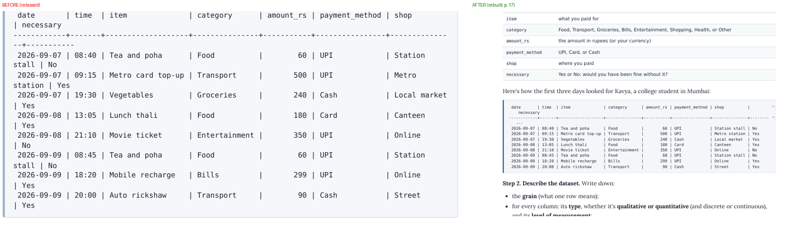
- `V11.1`: 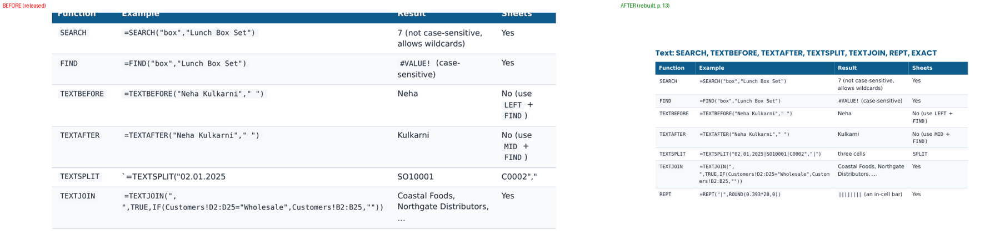
- `V11.2`: 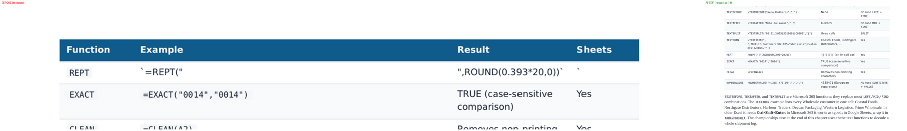
- `V11.3`: 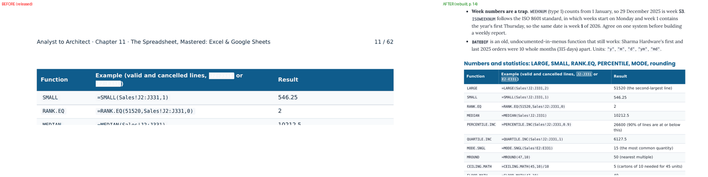
- `V11.4`: 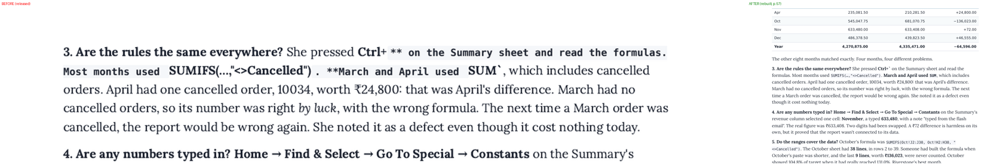
- `V12.1`: 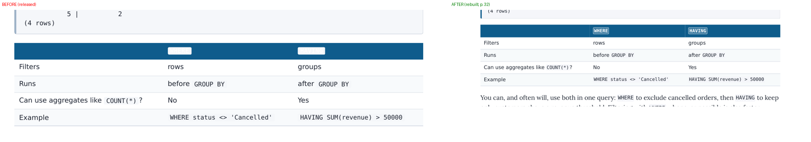
- `V12.2`: 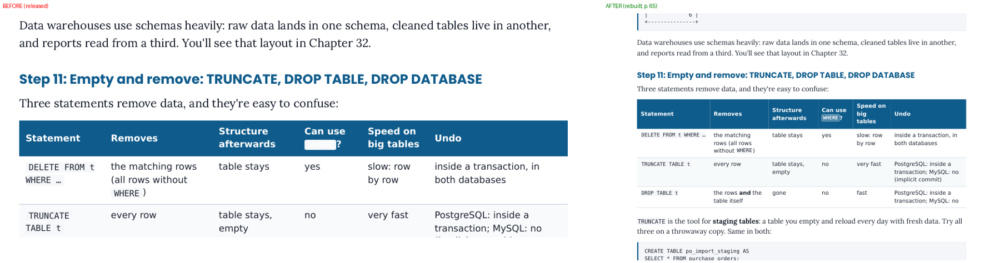
- `V19.1`: 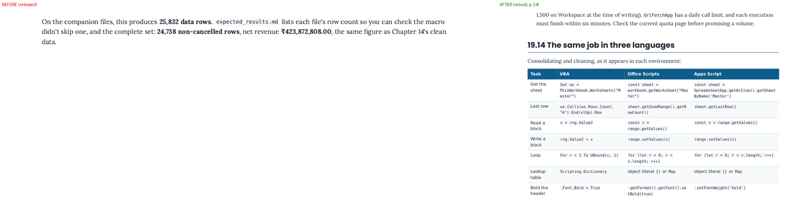
- `V27.1`: 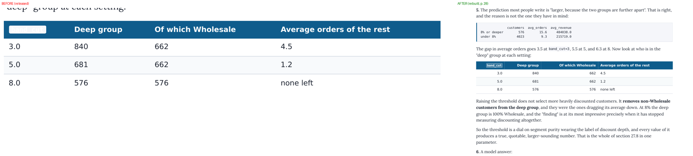
- `V30.1`: 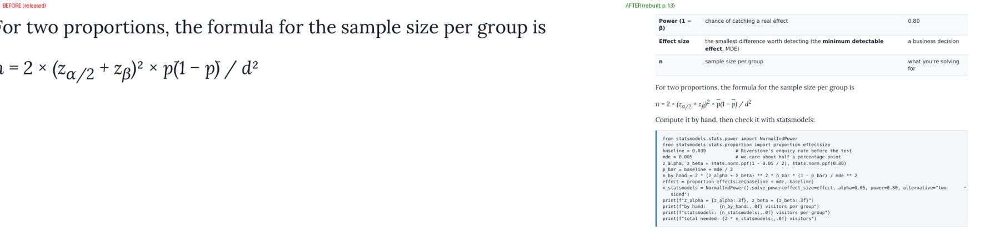
- `V35.1`: 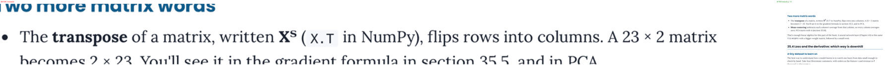
- `V49.1`: 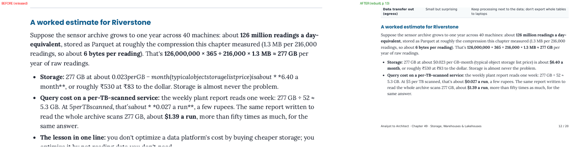
- `V49.2`: 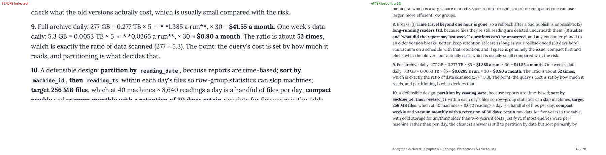
- `V54.1`: 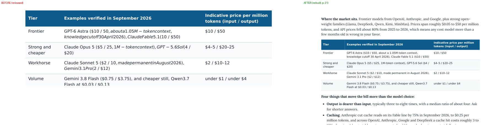
- `V54.2`: 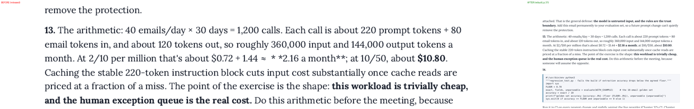
- `V56.1`: 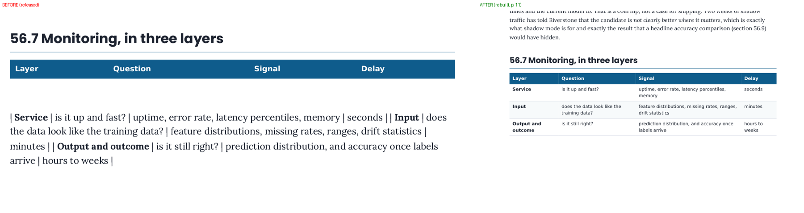
- `V63.1`: 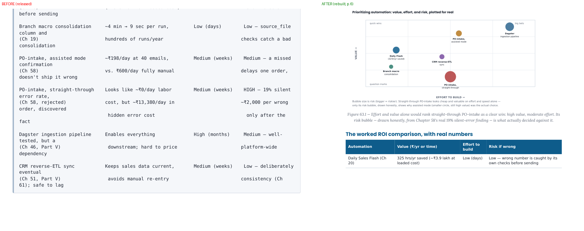

## Every finding closed, by chapter

`ID · status · what changed (and how it was checked)`

Ch 1 (11)

- V1.1 · Fixed · code fitted down to 7 pt, then hanging indent + continuation mark
- V1.6 · Fixed · keep-together of headings, lead-ins, answer numbers, captions; chapter check still flags this category, re-check in the part build
- V1.7 · Fixed · short code/tables kept whole, long ones may split; orphans/widows 4
- V1.8 · Verified · cover template: no badge, version or date; bar above the kicker; checked by layout_check.py on the rebuilt PDF
- V1.9 · Verified · contents page numbers (two-pass render); checked by layout_check.py on the rebuilt PDF
- V1.10 · Verified · long code blocks may split; keep groups capped at 45% of a page; checked by layout_check.py on the rebuilt PDF
- V1.11 · Fixed · short code/tables kept whole, long ones may split; orphans/widows 4
- V1.12 · Fixed · code fitted down to 7 pt, then hanging indent + continuation mark
- V1.13 · Fixed · numeric columns right-aligned (layout.js)
- V1.14 · Verified · ol indent 8.5 mm; checked by layout_check.py on the rebuilt PDF
- V1.15 · Fixed · Noto Serif fallback for ₹; sub/superscripts as markup; overline via CSS

Ch 2 (9)

- V2.6 · Fixed · short code/tables kept whole, long ones may split; orphans/widows 4
- V2.7 · Verified · cover template: no badge, version or date; bar above the kicker; checked by layout_check.py on the rebuilt PDF
- V2.8 · Verified · contents page numbers (two-pass render); checked by layout_check.py on the rebuilt PDF
- V2.9 · Verified · long code blocks may split; keep groups capped at 45% of a page; checked by layout_check.py on the rebuilt PDF
- V2.10 · Fixed · keep-together of headings, lead-ins, answer numbers, captions; chapter check still flags this category, re-check in the part build
- V2.11 · Fixed · code fitted down to 7 pt, then hanging indent + continuation mark
- V2.12 · Fixed · numeric columns right-aligned (layout.js)
- V2.13 · Verified · ol indent 8.5 mm; checked by layout_check.py on the rebuilt PDF
- V2.14 · Fixed · Noto Serif fallback for ₹; sub/superscripts as markup; overline via CSS

Ch 3 (10)

- V3.5 · Verified · long code blocks may split; keep groups capped at 45% of a page; checked by layout_check.py on the rebuilt PDF
- V3.6 · Verified · keep-together of headings, lead-ins, answer numbers, captions; checked by layout_check.py on the rebuilt PDF
- V3.7 · Verified · keep-together of headings, lead-ins, answer numbers, captions; checked by layout_check.py on the rebuilt PDF
- V3.8 · Verified · cover template: no badge, version or date; bar above the kicker; checked by layout_check.py on the rebuilt PDF
- V3.9 · Verified · contents page numbers (two-pass render); checked by layout_check.py on the rebuilt PDF
- V3.10 · Fixed · IDs, dates and hyphenated title words kept on one line; empty output boxes removed
- V3.11 · Fixed · short code/tables kept whole, long ones may split; orphans/widows 4
- V3.12 · Fixed · numeric columns right-aligned (layout.js)
- V3.14 · Fixed · Noto Serif fallback for ₹; sub/superscripts as markup; overline via CSS
- V3.15 · Verified · ol indent 8.5 mm; checked by layout_check.py on the rebuilt PDF

Ch 4 (10)

- V4.5 · Verified · long code blocks may split; keep groups capped at 45% of a page; checked by layout_check.py on the rebuilt PDF
- V4.6 · Fixed · short code/tables kept whole, long ones may split; orphans/widows 4
- V4.7 · Verified · keep-together of headings, lead-ins, answer numbers, captions; checked by layout_check.py on the rebuilt PDF
- V4.8 · Fixed · short code/tables kept whole, long ones may split; orphans/widows 4
- V4.9 · Verified · cover template: no badge, version or date; bar above the kicker; checked by layout_check.py on the rebuilt PDF
- V4.10 · Verified · contents page numbers (two-pass render); checked by layout_check.py on the rebuilt PDF
- V4.12 · Fixed · numeric columns right-aligned (layout.js)
- V4.13 · Fixed · short code/tables kept whole, long ones may split; orphans/widows 4
- V4.14 · Verified · ol indent 8.5 mm; checked by layout_check.py on the rebuilt PDF
- V4.15 · Fixed · Noto Serif fallback for ₹; sub/superscripts as markup; overline via CSS

Ch 5 (10)

- V5.5 · Verified · long code blocks may split; keep groups capped at 45% of a page; checked by layout_check.py on the rebuilt PDF
- V5.6 · Verified · keep-together of headings, lead-ins, answer numbers, captions; checked by layout_check.py on the rebuilt PDF
- V5.7 · Fixed · short code/tables kept whole, long ones may split; orphans/widows 4
- V5.8 · Verified · cover template: no badge, version or date; bar above the kicker; checked by layout_check.py on the rebuilt PDF
- V5.9 · Verified · contents page numbers (two-pass render); checked by layout_check.py on the rebuilt PDF
- V5.10 · Verified · long code blocks may split; keep groups capped at 45% of a page; checked by layout_check.py on the rebuilt PDF
- V5.11 · Fixed · short code/tables kept whole, long ones may split; orphans/widows 4
- V5.12 · Fixed · numeric columns right-aligned (layout.js)
- V5.13 · Verified · ol indent 8.5 mm; checked by layout_check.py on the rebuilt PDF
- V5.14 · Fixed · Noto Serif fallback for ₹; sub/superscripts as markup; overline via CSS

Ch 6 (10)

- V6.3 · Verified · long code blocks may split; keep groups capped at 45% of a page; checked by layout_check.py on the rebuilt PDF
- V6.4 · Verified · keep-together of headings, lead-ins, answer numbers, captions; checked by layout_check.py on the rebuilt PDF
- V6.5 · Verified · cover template: no badge, version or date; bar above the kicker; checked by layout_check.py on the rebuilt PDF
- V6.6 · Verified · contents page numbers (two-pass render); checked by layout_check.py on the rebuilt PDF
- V6.7 · Fixed · code fitted down to 7 pt, then hanging indent + continuation mark
- V6.9 · Fixed · short code/IDs in cells never wrap; long code wraps only where needed
- V6.10 · Fixed · code fitted down to 7 pt, then hanging indent + continuation mark
- V6.11 · Fixed · short code/tables kept whole, long ones may split; orphans/widows 4
- V6.12 · Verified · ol indent 8.5 mm; checked by layout_check.py on the rebuilt PDF
- V6.13 · Fixed · Noto Serif fallback for ₹; sub/superscripts as markup; overline via CSS

Ch 7 (9)

- V7.6 · Verified · long code blocks may split; keep groups capped at 45% of a page; checked by layout_check.py on the rebuilt PDF
- V7.7 · Verified · long code blocks may split; keep groups capped at 45% of a page; checked by layout_check.py on the rebuilt PDF
- V7.8 · Verified · long code blocks may split; keep groups capped at 45% of a page; checked by layout_check.py on the rebuilt PDF
- V7.9 · Verified · keep-together of headings, lead-ins, answer numbers, captions; checked by layout_check.py on the rebuilt PDF
- V7.10 · Verified · cover template: no badge, version or date; bar above the kicker; checked by layout_check.py on the rebuilt PDF
- V7.11 · Verified · contents page numbers (two-pass render); checked by layout_check.py on the rebuilt PDF
- V7.12 · Fixed · short code/tables kept whole, long ones may split; orphans/widows 4
- V7.14 · Verified · ol indent 8.5 mm; checked by layout_check.py on the rebuilt PDF
- V7.15 · Fixed · Noto Serif fallback for ₹; sub/superscripts as markup; overline via CSS

Ch 8 (9)

- V8.5 · Verified · long code blocks may split; keep groups capped at 45% of a page; checked by layout_check.py on the rebuilt PDF
- V8.6 · Verified · long code blocks may split; keep groups capped at 45% of a page; checked by layout_check.py on the rebuilt PDF
- V8.7 · Verified · keep-together of headings, lead-ins, answer numbers, captions; checked by layout_check.py on the rebuilt PDF
- V8.8 · Verified · cover template: no badge, version or date; bar above the kicker; checked by layout_check.py on the rebuilt PDF
- V8.9 · Verified · contents page numbers (two-pass render); checked by layout_check.py on the rebuilt PDF
- V8.11 · Fixed · numeric columns right-aligned (layout.js)
- V8.12 · Fixed · short code/IDs in cells never wrap; long code wraps only where needed
- V8.13 · Verified · ol indent 8.5 mm; checked by layout_check.py on the rebuilt PDF
- V8.14 · Fixed · Noto Serif fallback for ₹; sub/superscripts as markup; overline via CSS

Ch 9 (9)

- V9.5 · Verified · keep-together of headings, lead-ins, answer numbers, captions; checked by layout_check.py on the rebuilt PDF
- V9.6 · Fixed · short code/tables kept whole, long ones may split; orphans/widows 4
- V9.7 · Verified · keep-together of headings, lead-ins, answer numbers, captions; checked by layout_check.py on the rebuilt PDF
- V9.8 · Verified · cover template: no badge, version or date; bar above the kicker; checked by layout_check.py on the rebuilt PDF
- V9.9 · Verified · contents page numbers (two-pass render); checked by layout_check.py on the rebuilt PDF
- V9.10 · Fixed · short code/tables kept whole, long ones may split; orphans/widows 4
- V9.11 · Fixed · short code/tables kept whole, long ones may split; orphans/widows 4
- V9.12 · Fixed · numeric columns right-aligned (layout.js)
- V9.13 · Verified · ol indent 8.5 mm; checked by layout_check.py on the rebuilt PDF

Ch 10 (12)

- V10.1 · Verified · ol indent 8.5 mm; checked by layout_check.py on the rebuilt PDF
- V10.7 · Fixed · code fitted down to 7 pt, then hanging indent + continuation mark
- V10.8 · Verified · cover template: no badge, version or date; bar above the kicker; checked by layout_check.py on the rebuilt PDF
- V10.9 · Verified · contents page numbers (two-pass render); checked by layout_check.py on the rebuilt PDF
- V10.10 · Fixed · short code/tables kept whole, long ones may split; orphans/widows 4
- V10.11 · Fixed · short code/tables kept whole, long ones may split; orphans/widows 4
- V10.12 · Fixed · short code/tables kept whole, long ones may split; orphans/widows 4
- V10.13 · Fixed · short code/tables kept whole, long ones may split; orphans/widows 4
- V10.15 · Verified · keep-together of headings, lead-ins, answer numbers, captions; checked by layout_check.py on the rebuilt PDF
- V10.16 · Fixed · numeric columns right-aligned (layout.js)
- V10.17 · Fixed · pill padding, code in headings, checklist hanging indent, output style, redundant rules
- V10.19 · Fixed · Noto Serif fallback for ₹; sub/superscripts as markup; overline via CSS

Ch 11 (17)

- V11.1 · Fixed · source fix, no wording change: table repaired in source
- V11.2 · Fixed · source fix, no wording change: table repaired in source
- V11.3 · Fixed · header code pills restyled (light border, white text)
- V11.4 · Fixed · source fix, no wording change: escaped in source
- V11.5 · Verified · ol indent 8.5 mm; checked by layout_check.py on the rebuilt PDF
- V11.14 · Fixed · code fitted down to 7 pt, then hanging indent + continuation mark
- V11.15 · Verified · long code blocks may split; keep groups capped at 45% of a page; checked by layout_check.py on the rebuilt PDF
- V11.16 · Verified · cover template: no badge, version or date; bar above the kicker; checked by layout_check.py on the rebuilt PDF
- V11.17 · Verified · contents page numbers (two-pass render); checked by layout_check.py on the rebuilt PDF
- V11.18 · Fixed · short code/tables kept whole, long ones may split; orphans/widows 4
- V11.19 · Fixed · short code/tables kept whole, long ones may split; orphans/widows 4
- V11.20 · Fixed · short code/tables kept whole, long ones may split; orphans/widows 4
- V11.21 · Verified · long code blocks may split; keep groups capped at 45% of a page; checked by layout_check.py on the rebuilt PDF
- V11.22 · Fixed · short code/tables kept whole, long ones may split; orphans/widows 4
- V11.23 · Fixed · short code/IDs in cells never wrap; long code wraps only where needed
- V11.24 · Fixed · numeric columns right-aligned (layout.js)
- V11.26 · Fixed · Noto Serif fallback for ₹; sub/superscripts as markup; overline via CSS

Ch 12 (21)

- V12.1 · Fixed · header code pills restyled (light border, white text)
- V12.2 · Fixed · header code pills restyled (light border, white text)
- V12.3 · Verified · ol indent 8.5 mm; checked by layout_check.py on the rebuilt PDF
- V12.9 · Fixed · code fitted down to 7 pt, then hanging indent + continuation mark
- V12.10 · Fixed · code fitted down to 7 pt, then hanging indent + continuation mark
- V12.13 · Fixed · long code blocks may split; keep groups capped at 45% of a page; chapter check still flags this category, re-check in the part build
- V12.14 · Fixed · keep-together of headings, lead-ins, answer numbers, captions; chapter check still flags this category, re-check in the part build
- V12.15 · Verified · cover template: no badge, version or date; bar above the kicker; checked by layout_check.py on the rebuilt PDF
- V12.16 · Verified · contents page numbers (two-pass render); checked by layout_check.py on the rebuilt PDF
- V12.17 · Fixed · keep-together of headings, lead-ins, answer numbers, captions; chapter check still flags this category, re-check in the part build
- V12.18 · Fixed · keep-together of headings, lead-ins, answer numbers, captions; chapter check still flags this category, re-check in the part build
- V12.19 · Fixed · code fitted down to 7 pt, then hanging indent + continuation mark
- V12.20 · Fixed · short code/tables kept whole, long ones may split; orphans/widows 4
- V12.21 · Fixed · short code/tables kept whole, long ones may split; orphans/widows 4
- V12.22 · Fixed · short code/tables kept whole, long ones may split; orphans/widows 4
- V12.24 · Fixed · short code/IDs in cells never wrap; long code wraps only where needed
- V12.25 · Fixed · code fitted down to 7 pt, then hanging indent + continuation mark
- V12.26 · Fixed · pill padding, code in headings, checklist hanging indent, output style, redundant rules
- V12.27 · Fixed · pill padding, code in headings, checklist hanging indent, output style, redundant rules
- V12.29 · Fixed · pill padding, code in headings, checklist hanging indent, output style, redundant rules
- V12.30 · Fixed · Noto Serif fallback for ₹; sub/superscripts as markup; overline via CSS

Ch 13 (15)

- V13.1 · Verified · ol indent 8.5 mm; checked by layout_check.py on the rebuilt PDF
- V13.6 · Fixed · code fitted down to 7 pt, then hanging indent + continuation mark
- V13.7 · Verified · long code blocks may split; keep groups capped at 45% of a page; checked by layout_check.py on the rebuilt PDF
- V13.8 · Verified · long code blocks may split; keep groups capped at 45% of a page; checked by layout_check.py on the rebuilt PDF
- V13.9 · Verified · long code blocks may split; keep groups capped at 45% of a page; checked by layout_check.py on the rebuilt PDF
- V13.10 · Verified · keep-together of headings, lead-ins, answer numbers, captions; checked by layout_check.py on the rebuilt PDF
- V13.11 · Verified · long code blocks may split; keep groups capped at 45% of a page; checked by layout_check.py on the rebuilt PDF
- V13.12 · Verified · keep-together of headings, lead-ins, answer numbers, captions; checked by layout_check.py on the rebuilt PDF
- V13.13 · Verified · keep-together of headings, lead-ins, answer numbers, captions; checked by layout_check.py on the rebuilt PDF
- V13.15 · Verified · cover template: no badge, version or date; bar above the kicker; checked by layout_check.py on the rebuilt PDF
- V13.16 · Verified · contents page numbers (two-pass render); checked by layout_check.py on the rebuilt PDF
- V13.17 · Verified · keep-together of headings, lead-ins, answer numbers, captions; checked by layout_check.py on the rebuilt PDF
- V13.18 · Fixed · short code/IDs in cells never wrap; long code wraps only where needed
- V13.20 · Fixed · pill padding, code in headings, checklist hanging indent, output style, redundant rules
- V13.21 · Fixed · Noto Serif fallback for ₹; sub/superscripts as markup; overline via CSS

Ch 14 (13)

- V14.1 · Verified · ol indent 8.5 mm; checked by layout_check.py on the rebuilt PDF
- V14.8 · Fixed · code fitted down to 7 pt, then hanging indent + continuation mark
- V14.9 · Fixed · long code blocks may split; keep groups capped at 45% of a page; chapter check still flags this category, re-check in the part build
- V14.10 · Verified · keep-together of headings, lead-ins, answer numbers, captions; checked by layout_check.py on the rebuilt PDF
- V14.11 · Fixed · short code/tables kept whole, long ones may split; orphans/widows 4
- V14.12 · Fixed · long code blocks may split; keep groups capped at 45% of a page; chapter check still flags this category, re-check in the part build
- V14.13 · Verified · keep-together of headings, lead-ins, answer numbers, captions; checked by layout_check.py on the rebuilt PDF
- V14.14 · Verified · cover template: no badge, version or date; bar above the kicker; checked by layout_check.py on the rebuilt PDF
- V14.15 · Verified · contents page numbers (two-pass render); checked by layout_check.py on the rebuilt PDF
- V14.16 · Fixed · numeric columns right-aligned (layout.js)
- V14.17 · Fixed · short code/IDs in cells never wrap; long code wraps only where needed
- V14.18 · Fixed · short code/tables kept whole, long ones may split; orphans/widows 4
- V14.19 · Fixed · Noto Serif fallback for ₹; sub/superscripts as markup; overline via CSS

Ch 15 (9)

- V15.3 · Verified · ol indent 8.5 mm; checked by layout_check.py on the rebuilt PDF
- V15.8 · Verified · long code blocks may split; keep groups capped at 45% of a page; checked by layout_check.py on the rebuilt PDF
- V15.9 · Verified · long code blocks may split; keep groups capped at 45% of a page; checked by layout_check.py on the rebuilt PDF
- V15.10 · Verified · long code blocks may split; keep groups capped at 45% of a page; checked by layout_check.py on the rebuilt PDF
- V15.11 · Fixed · keep-together of headings, lead-ins, answer numbers, captions; chapter check still flags this category, re-check in the part build
- V15.12 · Fixed · rasters re-exported at 300 ppi
- V15.13 · Verified · cover template: no badge, version or date; bar above the kicker; checked by layout_check.py on the rebuilt PDF
- V15.14 · Verified · contents page numbers (two-pass render); checked by layout_check.py on the rebuilt PDF
- V15.17 · Fixed · Noto Serif fallback for ₹; sub/superscripts as markup; overline via CSS

Ch 16 (13)

- V16.1 · Verified · ol indent 8.5 mm; checked by layout_check.py on the rebuilt PDF
- V16.8 · Fixed · code fitted down to 7 pt, then hanging indent + continuation mark
- V16.9 · Verified · long code blocks may split; keep groups capped at 45% of a page; checked by layout_check.py on the rebuilt PDF
- V16.10 · Verified · long code blocks may split; keep groups capped at 45% of a page; checked by layout_check.py on the rebuilt PDF
- V16.11 · Fixed · keep-together of headings, lead-ins, answer numbers, captions; chapter check still flags this category, re-check in the part build
- V16.12 · Verified · cover template: no badge, version or date; bar above the kicker; checked by layout_check.py on the rebuilt PDF
- V16.13 · Verified · contents page numbers (two-pass render); checked by layout_check.py on the rebuilt PDF
- V16.14 · Verified · long code blocks may split; keep groups capped at 45% of a page; checked by layout_check.py on the rebuilt PDF
- V16.15 · Fixed · keep-together of headings, lead-ins, answer numbers, captions; chapter check still flags this category, re-check in the part build
- V16.16 · Fixed · pill padding, code in headings, checklist hanging indent, output style, redundant rules
- V16.17 · Fixed · numeric columns right-aligned (layout.js)
- V16.18 · Fixed · code fitted down to 7 pt, then hanging indent + continuation mark
- V16.19 · Fixed · Noto Serif fallback for ₹; sub/superscripts as markup; overline via CSS

Ch 17 (11)

- V17.5 · Verified · ol indent 8.5 mm; checked by layout_check.py on the rebuilt PDF
- V17.6 · Fixed · code fitted down to 7 pt, then hanging indent + continuation mark
- V17.7 · Verified · long code blocks may split; keep groups capped at 45% of a page; checked by layout_check.py on the rebuilt PDF
- V17.8 · Verified · cover template: no badge, version or date; bar above the kicker; checked by layout_check.py on the rebuilt PDF
- V17.9 · Verified · contents page numbers (two-pass render); checked by layout_check.py on the rebuilt PDF
- V17.10 · Fixed · pill padding, code in headings, checklist hanging indent, output style, redundant rules
- V17.13 · Verified · keep-together of headings, lead-ins, answer numbers, captions; checked by layout_check.py on the rebuilt PDF
- V17.14 · Fixed · short code/tables kept whole, long ones may split; orphans/widows 4
- V17.15 · Fixed · pill padding, code in headings, checklist hanging indent, output style, redundant rules
- V17.17 · Fixed · code fitted down to 7 pt, then hanging indent + continuation mark
- V17.18 · Fixed · Noto Serif fallback for ₹; sub/superscripts as markup; overline via CSS

Ch 18 (12)

- V18.4 · Verified · cover template: no badge, version or date; bar above the kicker; checked by layout_check.py on the rebuilt PDF
- V18.5 · Verified · contents page numbers (two-pass render); checked by layout_check.py on the rebuilt PDF
- V18.6 · Verified · long code blocks may split; keep groups capped at 45% of a page; checked by layout_check.py on the rebuilt PDF
- V18.7 · Fixed · code fitted down to 7 pt, then hanging indent + continuation mark
- V18.8 · Verified · ol indent 8.5 mm; checked by layout_check.py on the rebuilt PDF
- V18.9 · Fixed · pill padding, code in headings, checklist hanging indent, output style, redundant rules
- V18.12 · Fixed · short code/IDs in cells never wrap; long code wraps only where needed
- V18.13 · Fixed · code fitted down to 7 pt, then hanging indent + continuation mark
- V18.14 · Fixed · short code/tables kept whole, long ones may split; orphans/widows 4
- V18.15 · Fixed · pill padding, code in headings, checklist hanging indent, output style, redundant rules
- V18.17 · Fixed · pill padding, code in headings, checklist hanging indent, output style, redundant rules
- V18.18 · Fixed · Noto Serif fallback for ₹; sub/superscripts as markup; overline via CSS

Ch 19 (12)

- V19.1 · Fixed · overflowing table cells wrap; overflow guard in the builder
- V19.2 · Verified · long code blocks may split; keep groups capped at 45% of a page; checked by layout_check.py on the rebuilt PDF
- V19.3 · Fixed · keep-together of headings, lead-ins, answer numbers, captions; chapter check still flags this category, re-check in the part build
- V19.4 · Verified · ol indent 8.5 mm; checked by layout_check.py on the rebuilt PDF
- V19.5 · Verified · cover template: no badge, version or date; bar above the kicker; checked by layout_check.py on the rebuilt PDF
- V19.6 · Verified · contents page numbers (two-pass render); checked by layout_check.py on the rebuilt PDF
- V19.8 · Fixed · keep-together of headings, lead-ins, answer numbers, captions; chapter check still flags this category, re-check in the part build
- V19.9 · Fixed · short code/IDs in cells never wrap; long code wraps only where needed
- V19.10 · Fixed · pill padding, code in headings, checklist hanging indent, output style, redundant rules
- V19.11 · Fixed · short code/tables kept whole, long ones may split; orphans/widows 4
- V19.13 · Fixed · pill padding, code in headings, checklist hanging indent, output style, redundant rules
- V19.14 · Fixed · Noto Serif fallback for ₹; sub/superscripts as markup; overline via CSS

Ch 20 (11)

- V20.4 · Fixed · Fig 20.3 regenerated from daily_flash.py at 376 ppi
- V20.5 · Verified · long code blocks may split; keep groups capped at 45% of a page; checked by layout_check.py on the rebuilt PDF
- V20.6 · Fixed · code fitted down to 7 pt, then hanging indent + continuation mark
- V20.7 · Verified · cover template: no badge, version or date; bar above the kicker; checked by layout_check.py on the rebuilt PDF
- V20.8 · Verified · contents page numbers (two-pass render); checked by layout_check.py on the rebuilt PDF
- V20.9 · Verified · ol indent 8.5 mm; checked by layout_check.py on the rebuilt PDF
- V20.10 · Fixed · code fitted down to 7 pt, then hanging indent + continuation mark
- V20.13 · Verified · long code blocks may split; keep groups capped at 45% of a page; checked by layout_check.py on the rebuilt PDF
- V20.14 · Fixed · short code/IDs in cells never wrap; long code wraps only where needed
- V20.15 · Fixed · pill padding, code in headings, checklist hanging indent, output style, redundant rules
- V20.17 · Fixed · Noto Serif fallback for ₹; sub/superscripts as markup; overline via CSS

Ch 21 (8)

- V21.2 · Verified · cover template: no badge, version or date; bar above the kicker; checked by layout_check.py on the rebuilt PDF
- V21.3 · Verified · contents page numbers (two-pass render); checked by layout_check.py on the rebuilt PDF
- V21.4 · Verified · ol indent 8.5 mm; checked by layout_check.py on the rebuilt PDF
- V21.5 · Fixed · code fitted down to 7 pt, then hanging indent + continuation mark
- V21.10 · Verified · keep-together of headings, lead-ins, answer numbers, captions; checked by layout_check.py on the rebuilt PDF
- V21.11 · Verified · keep-together of headings, lead-ins, answer numbers, captions; checked by layout_check.py on the rebuilt PDF
- V21.12 · Fixed · pill padding, code in headings, checklist hanging indent, output style, redundant rules
- V21.14 · Fixed · Noto Serif fallback for ₹; sub/superscripts as markup; overline via CSS

Ch 22 (10)

- V22.4 · Verified · long code blocks may split; keep groups capped at 45% of a page; checked by layout_check.py on the rebuilt PDF
- V22.5 · Verified · keep-together of headings, lead-ins, answer numbers, captions; checked by layout_check.py on the rebuilt PDF
- V22.6 · Fixed · short code/tables kept whole, long ones may split; orphans/widows 4
- V22.7 · Fixed · code fitted down to 7 pt, then hanging indent + continuation mark
- V22.8 · Verified · cover template: no badge, version or date; bar above the kicker; checked by layout_check.py on the rebuilt PDF
- V22.9 · Verified · contents page numbers (two-pass render); checked by layout_check.py on the rebuilt PDF
- V22.10 · Verified · ol indent 8.5 mm; checked by layout_check.py on the rebuilt PDF
- V22.14 · Fixed · pill padding, code in headings, checklist hanging indent, output style, redundant rules
- V22.15 · Fixed · pill padding, code in headings, checklist hanging indent, output style, redundant rules
- V22.17 · Fixed · Noto Serif fallback for ₹; sub/superscripts as markup; overline via CSS

Ch 23 (12)

- V23.5 · Fixed · code fitted down to 7 pt, then hanging indent + continuation mark
- V23.6 · Fixed · code fitted down to 7 pt, then hanging indent + continuation mark
- V23.7 · Verified · ol indent 8.5 mm; checked by layout_check.py on the rebuilt PDF
- V23.8 · Verified · cover template: no badge, version or date; bar above the kicker; checked by layout_check.py on the rebuilt PDF
- V23.9 · Verified · contents page numbers (two-pass render); checked by layout_check.py on the rebuilt PDF
- V23.10 · Fixed · short code/tables kept whole, long ones may split; orphans/widows 4
- V23.11 · Fixed · numeric columns right-aligned (layout.js)
- V23.12 · Fixed · pill padding, code in headings, checklist hanging indent, output style, redundant rules
- V23.13 · Fixed · code fitted down to 7 pt, then hanging indent + continuation mark
- V23.15 · Fixed · pill padding, code in headings, checklist hanging indent, output style, redundant rules
- V23.17 · Fixed · balanced title lines
- V23.18 · Verified · long code blocks may split; keep groups capped at 45% of a page; checked by layout_check.py on the rebuilt PDF

Ch 24 (11)

- V24.5 · Fixed · long code blocks may split; keep groups capped at 45% of a page; chapter check still flags this category, re-check in the part build
- V24.6 · Fixed · long code blocks may split; keep groups capped at 45% of a page; chapter check still flags this category, re-check in the part build
- V24.7 · Fixed · bold-label lines start a new line
- V24.9 · Verified · ol indent 8.5 mm; checked by layout_check.py on the rebuilt PDF
- V24.10 · Verified · keep-together of headings, lead-ins, answer numbers, captions; checked by layout_check.py on the rebuilt PDF
- V24.11 · Verified · cover template: no badge, version or date; bar above the kicker; checked by layout_check.py on the rebuilt PDF
- V24.12 · Verified · contents page numbers (two-pass render); checked by layout_check.py on the rebuilt PDF
- V24.13 · Fixed · short code/tables kept whole, long ones may split; orphans/widows 4
- V24.15 · Fixed · pill padding, code in headings, checklist hanging indent, output style, redundant rules
- V24.16 · Fixed · pill padding, code in headings, checklist hanging indent, output style, redundant rules
- V24.17 · Fixed · pill padding, code in headings, checklist hanging indent, output style, redundant rules

Ch 25 (10)

- V25.7 · Verified · cover template: no badge, version or date; bar above the kicker; checked by layout_check.py on the rebuilt PDF
- V25.8 · Verified · contents page numbers (two-pass render); checked by layout_check.py on the rebuilt PDF
- V25.9 · Fixed · bold-label lines start a new line
- V25.10 · Verified · long code blocks may split; keep groups capped at 45% of a page; checked by layout_check.py on the rebuilt PDF
- V25.11 · Fixed · keep-together of headings, lead-ins, answer numbers, captions; chapter check still flags this category, re-check in the part build
- V25.12 · Fixed · IDs kept on one line
- V25.13 · Fixed · bold-label lines start a new line
- V25.17 · Fixed · numeric columns right-aligned (layout.js)
- V25.18 · Verified · ol indent 8.5 mm; checked by layout_check.py on the rebuilt PDF
- V25.19 · Verified · long code blocks may split; keep groups capped at 45% of a page; checked by layout_check.py on the rebuilt PDF

Ch 26 (11)

- V26.3 · Fixed · long code blocks may split; keep groups capped at 45% of a page; chapter check still flags this category, re-check in the part build
- V26.4 · Fixed · long code blocks may split; keep groups capped at 45% of a page; chapter check still flags this category, re-check in the part build
- V26.5 · Fixed · long code blocks may split; keep groups capped at 45% of a page; chapter check still flags this category, re-check in the part build
- V26.6 · Fixed · short code/IDs in cells never wrap; long code wraps only where needed
- V26.7 · Fixed · keep-together of headings, lead-ins, answer numbers, captions; chapter check still flags this category, re-check in the part build
- V26.8 · Verified · cover template: no badge, version or date; bar above the kicker; checked by layout_check.py on the rebuilt PDF
- V26.9 · Verified · contents page numbers (two-pass render); checked by layout_check.py on the rebuilt PDF
- V26.13 · Fixed · code fitted down to 7 pt, then hanging indent + continuation mark
- V26.14 · Fixed · pill padding, code in headings, checklist hanging indent, output style, redundant rules
- V26.15 · Fixed · short code/IDs in cells never wrap; long code wraps only where needed
- V26.16 · Fixed · short code/tables kept whole, long ones may split; orphans/widows 4

Ch 27 (13)

- V27.1 · Fixed · header code pills restyled (light border, white text)
- V27.5 · Fixed · code fitted down to 7 pt, then hanging indent + continuation mark
- V27.7 · Verified · long code blocks may split; keep groups capped at 45% of a page; checked by layout_check.py on the rebuilt PDF
- V27.8 · Fixed · keep-together of headings, lead-ins, answer numbers, captions; chapter check still flags this category, re-check in the part build
- V27.9 · Fixed · bold-label lines start a new line
- V27.10 · Verified · cover template: no badge, version or date; bar above the kicker; checked by layout_check.py on the rebuilt PDF
- V27.11 · Verified · contents page numbers (two-pass render); checked by layout_check.py on the rebuilt PDF
- V27.12 · Fixed · keep-together of headings, lead-ins, answer numbers, captions; chapter check still flags this category, re-check in the part build
- V27.13 · Fixed · code fitted down to 7 pt, then hanging indent + continuation mark
- V27.14 · Fixed · pill padding, code in headings, checklist hanging indent, output style, redundant rules
- V27.16 · Fixed · numeric columns right-aligned (layout.js)
- V27.17 · Verified · ol indent 8.5 mm; checked by layout_check.py on the rebuilt PDF
- V27.18 · Verified · cover template: no badge, version or date; bar above the kicker; checked by layout_check.py on the rebuilt PDF

Ch 28 (12)

- V28.2 · Fixed · code fitted down to 7 pt, then hanging indent + continuation mark
- V28.6 · Verified · long code blocks may split; keep groups capped at 45% of a page; checked by layout_check.py on the rebuilt PDF
- V28.7 · Fixed · keep-together of headings, lead-ins, answer numbers, captions; chapter check still flags this category, re-check in the part build
- V28.8 · Fixed · keep-together of headings, lead-ins, answer numbers, captions; chapter check still flags this category, re-check in the part build
- V28.9 · Fixed · short code/tables kept whole, long ones may split; orphans/widows 4
- V28.10 · Verified · cover template: no badge, version or date; bar above the kicker; checked by layout_check.py on the rebuilt PDF
- V28.11 · Verified · contents page numbers (two-pass render); checked by layout_check.py on the rebuilt PDF
- V28.12 · Verified · ol indent 8.5 mm; checked by layout_check.py on the rebuilt PDF
- V28.13 · Fixed · short code/IDs in cells never wrap; long code wraps only where needed
- V28.14 · Fixed · numeric columns right-aligned (layout.js)
- V28.15 · Fixed · pill padding, code in headings, checklist hanging indent, output style, redundant rules
- V28.19 · Fixed · balanced title lines

Ch 29 (12)

- V29.3 · Verified · long code blocks may split; keep groups capped at 45% of a page; checked by layout_check.py on the rebuilt PDF
- V29.4 · Fixed · code fitted down to 7 pt, then hanging indent + continuation mark
- V29.5 · Fixed · code fitted down to 7 pt, then hanging indent + continuation mark
- V29.6 · Verified · keep-together of headings, lead-ins, answer numbers, captions; checked by layout_check.py on the rebuilt PDF
- V29.7 · Verified · keep-together of headings, lead-ins, answer numbers, captions; checked by layout_check.py on the rebuilt PDF
- V29.8 · Verified · cover template: no badge, version or date; bar above the kicker; checked by layout_check.py on the rebuilt PDF
- V29.9 · Verified · contents page numbers (two-pass render); checked by layout_check.py on the rebuilt PDF
- V29.10 · Verified · ol indent 8.5 mm; checked by layout_check.py on the rebuilt PDF
- V29.11 · Fixed · short code/IDs in cells never wrap; long code wraps only where needed
- V29.12 · Fixed · short code/IDs in cells never wrap; long code wraps only where needed
- V29.15 · Fixed · code fitted down to 7 pt, then hanging indent + continuation mark
- V29.17 · Fixed · pill padding, code in headings, checklist hanging indent, output style, redundant rules

Ch 30 (9)

- V30.1 · Fixed · overline drawn by CSS
- V30.7 · Verified · long code blocks may split; keep groups capped at 45% of a page; checked by layout_check.py on the rebuilt PDF
- V30.8 · Verified · keep-together of headings, lead-ins, answer numbers, captions; checked by layout_check.py on the rebuilt PDF
- V30.9 · Fixed · short code/tables kept whole, long ones may split; orphans/widows 4
- V30.10 · Verified · cover template: no badge, version or date; bar above the kicker; checked by layout_check.py on the rebuilt PDF
- V30.11 · Verified · contents page numbers (two-pass render); checked by layout_check.py on the rebuilt PDF
- V30.12 · Fixed · code fitted down to 7 pt, then hanging indent + continuation mark
- V30.14 · Fixed · pill padding, code in headings, checklist hanging indent, output style, redundant rules
- V30.15 · Fixed · pill padding, code in headings, checklist hanging indent, output style, redundant rules

Ch 31 (7)

- V31.7 · Verified · long code blocks may split; keep groups capped at 45% of a page; checked by layout_check.py on the rebuilt PDF
- V31.8 · Verified · keep-together of headings, lead-ins, answer numbers, captions; checked by layout_check.py on the rebuilt PDF
- V31.9 · Verified · cover template: no badge, version or date; bar above the kicker; checked by layout_check.py on the rebuilt PDF
- V31.10 · Verified · contents page numbers (two-pass render); checked by layout_check.py on the rebuilt PDF
- V31.11 · Fixed · code fitted down to 7 pt, then hanging indent + continuation mark
- V31.12 · Fixed · pill padding, code in headings, checklist hanging indent, output style, redundant rules
- V31.13 · Fixed · pill padding, code in headings, checklist hanging indent, output style, redundant rules

Ch 32 (10)

- V32.4 · Verified · long code blocks may split; keep groups capped at 45% of a page; checked by layout_check.py on the rebuilt PDF
- V32.5 · Verified · long code blocks may split; keep groups capped at 45% of a page; checked by layout_check.py on the rebuilt PDF
- V32.6 · Verified · long code blocks may split; keep groups capped at 45% of a page; checked by layout_check.py on the rebuilt PDF
- V32.7 · Verified · long code blocks may split; keep groups capped at 45% of a page; checked by layout_check.py on the rebuilt PDF
- V32.8 · Verified · cover template: no badge, version or date; bar above the kicker; checked by layout_check.py on the rebuilt PDF
- V32.9 · Verified · contents page numbers (two-pass render); checked by layout_check.py on the rebuilt PDF
- V32.10 · Fixed · code fitted down to 7 pt, then hanging indent + continuation mark
- V32.11 · Fixed · pill padding, code in headings, checklist hanging indent, output style, redundant rules
- V32.12 · Fixed · pill padding, code in headings, checklist hanging indent, output style, redundant rules
- V32.13 · Fixed · pill padding, code in headings, checklist hanging indent, output style, redundant rules

Ch 33 (10)

- V33.6 · Fixed · short code/IDs in cells never wrap; long code wraps only where needed
- V33.7 · Verified · keep-together of headings, lead-ins, answer numbers, captions; checked by layout_check.py on the rebuilt PDF
- V33.8 · Verified · long code blocks may split; keep groups capped at 45% of a page; checked by layout_check.py on the rebuilt PDF
- V33.9 · Verified · keep-together of headings, lead-ins, answer numbers, captions; checked by layout_check.py on the rebuilt PDF
- V33.10 · Verified · long code blocks may split; keep groups capped at 45% of a page; checked by layout_check.py on the rebuilt PDF
- V33.11 · Verified · cover template: no badge, version or date; bar above the kicker; checked by layout_check.py on the rebuilt PDF
- V33.12 · Verified · contents page numbers (two-pass render); checked by layout_check.py on the rebuilt PDF
- V33.13 · Fixed · code fitted down to 7 pt, then hanging indent + continuation mark
- V33.14 · Fixed · pill padding, code in headings, checklist hanging indent, output style, redundant rules
- V33.15 · Fixed · pill padding, code in headings, checklist hanging indent, output style, redundant rules

Ch 34 (10)

- V34.5 · Verified · long code blocks may split; keep groups capped at 45% of a page; checked by layout_check.py on the rebuilt PDF
- V34.6 · Fixed · keep-together of headings, lead-ins, answer numbers, captions; chapter check still flags this category, re-check in the part build
- V34.7 · Fixed · keep-together of headings, lead-ins, answer numbers, captions; chapter check still flags this category, re-check in the part build
- V34.8 · Verified · long code blocks may split; keep groups capped at 45% of a page; checked by layout_check.py on the rebuilt PDF
- V34.9 · Verified · cover template: no badge, version or date; bar above the kicker; checked by layout_check.py on the rebuilt PDF
- V34.10 · Verified · contents page numbers (two-pass render); checked by layout_check.py on the rebuilt PDF
- V34.11 · Fixed · code fitted down to 7 pt, then hanging indent + continuation mark
- V34.12 · Fixed · short code/IDs in cells never wrap; long code wraps only where needed
- V34.13 · Fixed · pill padding, code in headings, checklist hanging indent, output style, redundant rules
- V34.14 · Fixed · pill padding, code in headings, checklist hanging indent, output style, redundant rules

Ch 35 (11)

- V35.1 · Fixed · superscript T as markup
- V35.3 · Fixed · caret powers set as superscripts
- V35.4 · Fixed · IDs, dates and hyphenated title words kept on one line; empty output boxes removed
- V35.10 · Verified · keep-together of headings, lead-ins, answer numbers, captions; checked by layout_check.py on the rebuilt PDF
- V35.11 · Verified · keep-together of headings, lead-ins, answer numbers, captions; checked by layout_check.py on the rebuilt PDF
- V35.12 · Verified · cover template: no badge, version or date; bar above the kicker; checked by layout_check.py on the rebuilt PDF
- V35.13 · Verified · contents page numbers (two-pass render); checked by layout_check.py on the rebuilt PDF
- V35.15 · Fixed · numeric columns right-aligned (layout.js)
- V35.16 · Verified · long code blocks may split; keep groups capped at 45% of a page; checked by layout_check.py on the rebuilt PDF
- V35.17 · Verified · cover template: no badge, version or date; bar above the kicker; checked by layout_check.py on the rebuilt PDF
- V35.18 · Fixed · pill padding, code in headings, checklist hanging indent, output style, redundant rules

Ch 36 (11)

- V36.6 · Verified · long code blocks may split; keep groups capped at 45% of a page; checked by layout_check.py on the rebuilt PDF
- V36.7 · Verified · long code blocks may split; keep groups capped at 45% of a page; checked by layout_check.py on the rebuilt PDF
- V36.8 · Verified · long code blocks may split; keep groups capped at 45% of a page; checked by layout_check.py on the rebuilt PDF
- V36.9 · Fixed · keep-together of headings, lead-ins, answer numbers, captions; chapter check still flags this category, re-check in the part build
- V36.10 · Verified · cover template: no badge, version or date; bar above the kicker; checked by layout_check.py on the rebuilt PDF
- V36.11 · Verified · contents page numbers (two-pass render); checked by layout_check.py on the rebuilt PDF
- V36.12 · Verified · long code blocks may split; keep groups capped at 45% of a page; checked by layout_check.py on the rebuilt PDF
- V36.15 · Fixed · pill padding, code in headings, checklist hanging indent, output style, redundant rules
- V36.16 · Verified · ol indent 8.5 mm; checked by layout_check.py on the rebuilt PDF
- V36.17 · Fixed · short code/tables kept whole, long ones may split; orphans/widows 4
- V36.18 · Fixed · short code/tables kept whole, long ones may split; orphans/widows 4

Ch 37 (8)

- V37.5 · Fixed · keep-together of headings, lead-ins, answer numbers, captions; chapter check still flags this category, re-check in the part build
- V37.7 · Verified · long code blocks may split; keep groups capped at 45% of a page; checked by layout_check.py on the rebuilt PDF
- V37.8 · Fixed · keep-together of headings, lead-ins, answer numbers, captions; chapter check still flags this category, re-check in the part build
- V37.9 · Verified · cover template: no badge, version or date; bar above the kicker; checked by layout_check.py on the rebuilt PDF
- V37.10 · Verified · contents page numbers (two-pass render); checked by layout_check.py on the rebuilt PDF
- V37.11 · Fixed · subscripts as markup
- V37.14 · Fixed · pill padding, code in headings, checklist hanging indent, output style, redundant rules
- V37.15 · Verified · ol indent 8.5 mm; checked by layout_check.py on the rebuilt PDF

Ch 38 (10)

- V38.6 · Fixed · keep-together of headings, lead-ins, answer numbers, captions; chapter check still flags this category, re-check in the part build
- V38.7 · Verified · long code blocks may split; keep groups capped at 45% of a page; checked by layout_check.py on the rebuilt PDF
- V38.8 · Fixed · keep-together of headings, lead-ins, answer numbers, captions; chapter check still flags this category, re-check in the part build
- V38.9 · Verified · cover template: no badge, version or date; bar above the kicker; checked by layout_check.py on the rebuilt PDF
- V38.10 · Verified · contents page numbers (two-pass render); checked by layout_check.py on the rebuilt PDF
- V38.12 · Verified · long code blocks may split; keep groups capped at 45% of a page; checked by layout_check.py on the rebuilt PDF
- V38.13 · Verified · long code blocks may split; keep groups capped at 45% of a page; checked by layout_check.py on the rebuilt PDF
- V38.14 · Fixed · short code/tables kept whole, long ones may split; orphans/widows 4
- V38.16 · Verified · ol indent 8.5 mm; checked by layout_check.py on the rebuilt PDF
- V38.17 · Fixed · pill padding, code in headings, checklist hanging indent, output style, redundant rules

Ch 39 (11)

- V39.6 · Verified · long code blocks may split; keep groups capped at 45% of a page; checked by layout_check.py on the rebuilt PDF
- V39.7 · Fixed · short code/tables kept whole, long ones may split; orphans/widows 4
- V39.8 · Verified · long code blocks may split; keep groups capped at 45% of a page; checked by layout_check.py on the rebuilt PDF
- V39.9 · Verified · keep-together of headings, lead-ins, answer numbers, captions; checked by layout_check.py on the rebuilt PDF
- V39.10 · Verified · cover template: no badge, version or date; bar above the kicker; checked by layout_check.py on the rebuilt PDF
- V39.11 · Verified · contents page numbers (two-pass render); checked by layout_check.py on the rebuilt PDF
- V39.12 · Verified · long code blocks may split; keep groups capped at 45% of a page; checked by layout_check.py on the rebuilt PDF
- V39.13 · Verified · keep-together of headings, lead-ins, answer numbers, captions; checked by layout_check.py on the rebuilt PDF
- V39.15 · Fixed · IDs, dates and hyphenated title words kept on one line; empty output boxes removed
- V39.16 · Verified · ol indent 8.5 mm; checked by layout_check.py on the rebuilt PDF
- V39.17 · Fixed · pill padding, code in headings, checklist hanging indent, output style, redundant rules

Ch 40 (13)

- V40.5 · Fixed · long code blocks may split; keep groups capped at 45% of a page; chapter check still flags this category, re-check in the part build
- V40.6 · Fixed · long code blocks may split; keep groups capped at 45% of a page; chapter check still flags this category, re-check in the part build
- V40.7 · Verified · keep-together of headings, lead-ins, answer numbers, captions; checked by layout_check.py on the rebuilt PDF
- V40.8 · Verified · keep-together of headings, lead-ins, answer numbers, captions; checked by layout_check.py on the rebuilt PDF
- V40.9 · Verified · cover template: no badge, version or date; bar above the kicker; checked by layout_check.py on the rebuilt PDF
- V40.10 · Verified · contents page numbers (two-pass render); checked by layout_check.py on the rebuilt PDF
- V40.11 · Fixed · long code blocks may split; keep groups capped at 45% of a page; chapter check still flags this category, re-check in the part build
- V40.12 · Fixed · long code blocks may split; keep groups capped at 45% of a page; chapter check still flags this category, re-check in the part build
- V40.13 · Fixed · code fitted down to 7 pt, then hanging indent + continuation mark
- V40.14 · Fixed · subscripts as markup
- V40.15 · Fixed · short code/tables kept whole, long ones may split; orphans/widows 4
- V40.17 · Verified · ol indent 8.5 mm; checked by layout_check.py on the rebuilt PDF
- V40.18 · Fixed · pill padding, code in headings, checklist hanging indent, output style, redundant rules

Ch 41 (8)

- V41.3 · Verified · long code blocks may split; keep groups capped at 45% of a page; checked by layout_check.py on the rebuilt PDF
- V41.4 · Verified · long code blocks may split; keep groups capped at 45% of a page; checked by layout_check.py on the rebuilt PDF
- V41.5 · Fixed · keep-together of headings, lead-ins, answer numbers, captions; chapter check still flags this category, re-check in the part build
- V41.6 · Fixed · keep-together of headings, lead-ins, answer numbers, captions; chapter check still flags this category, re-check in the part build
- V41.7 · Verified · cover template: no badge, version or date; bar above the kicker; checked by layout_check.py on the rebuilt PDF
- V41.8 · Verified · contents page numbers (two-pass render); checked by layout_check.py on the rebuilt PDF
- V41.10 · Fixed · code fitted down to 7 pt, then hanging indent + continuation mark
- V41.11 · Fixed · short code/tables kept whole, long ones may split; orphans/widows 4

Ch 42 (8)

- V42.2 · Verified · long code blocks may split; keep groups capped at 45% of a page; checked by layout_check.py on the rebuilt PDF
- V42.3 · Fixed · keep-together of headings, lead-ins, answer numbers, captions; chapter check still flags this category, re-check in the part build
- V42.4 · Fixed · keep-together of headings, lead-ins, answer numbers, captions; chapter check still flags this category, re-check in the part build
- V42.5 · Fixed · short code/tables kept whole, long ones may split; orphans/widows 4
- V42.6 · Verified · cover template: no badge, version or date; bar above the kicker; checked by layout_check.py on the rebuilt PDF
- V42.7 · Verified · contents page numbers (two-pass render); checked by layout_check.py on the rebuilt PDF
- V42.9 · Fixed · subscripts as markup
- V42.10 · Verified · long code blocks may split; keep groups capped at 45% of a page; checked by layout_check.py on the rebuilt PDF

Ch 43 (9)

- V43.1 · Verified · long code blocks may split; keep groups capped at 45% of a page; checked by layout_check.py on the rebuilt PDF
- V43.2 · Verified · keep-together of headings, lead-ins, answer numbers, captions; checked by layout_check.py on the rebuilt PDF
- V43.3 · Verified · keep-together of headings, lead-ins, answer numbers, captions; checked by layout_check.py on the rebuilt PDF
- V43.4 · Verified · long code blocks may split; keep groups capped at 45% of a page; checked by layout_check.py on the rebuilt PDF
- V43.5 · Verified · cover template: no badge, version or date; bar above the kicker; checked by layout_check.py on the rebuilt PDF
- V43.6 · Verified · contents page numbers (two-pass render); checked by layout_check.py on the rebuilt PDF
- V43.7 · Fixed · caret powers set as superscripts
- V43.9 · Fixed · code fitted down to 7 pt, then hanging indent + continuation mark
- V43.10 · Verified · ol indent 8.5 mm; checked by layout_check.py on the rebuilt PDF

Ch 44 (10)

- V44.1 · Fixed · bold-label lines start a new line
- V44.2 · Verified · keep-together of headings, lead-ins, answer numbers, captions; checked by layout_check.py on the rebuilt PDF
- V44.3 · Verified · keep-together of headings, lead-ins, answer numbers, captions; checked by layout_check.py on the rebuilt PDF
- V44.4 · Verified · keep-together of headings, lead-ins, answer numbers, captions; checked by layout_check.py on the rebuilt PDF
- V44.5 · Verified · keep-together of headings, lead-ins, answer numbers, captions; checked by layout_check.py on the rebuilt PDF
- V44.6 · Verified · cover template: no badge, version or date; bar above the kicker; checked by layout_check.py on the rebuilt PDF
- V44.7 · Verified · contents page numbers (two-pass render); checked by layout_check.py on the rebuilt PDF
- V44.8 · Fixed · numeric columns right-aligned (layout.js)
- V44.9 · Verified · keep-together of headings, lead-ins, answer numbers, captions; checked by layout_check.py on the rebuilt PDF
- V44.10 · Fixed · Noto Serif fallback for ₹; sub/superscripts as markup; overline via CSS

Ch 45 (8)

- V45.5 · Verified · long code blocks may split; keep groups capped at 45% of a page; checked by layout_check.py on the rebuilt PDF
- V45.6 · Verified · long code blocks may split; keep groups capped at 45% of a page; checked by layout_check.py on the rebuilt PDF
- V45.7 · Fixed · code fitted down to 7 pt, then hanging indent + continuation mark
- V45.8 · Verified · keep-together of headings, lead-ins, answer numbers, captions; checked by layout_check.py on the rebuilt PDF
- V45.9 · Verified · cover template: no badge, version or date; bar above the kicker; checked by layout_check.py on the rebuilt PDF
- V45.10 · Verified · contents page numbers (two-pass render); checked by layout_check.py on the rebuilt PDF
- V45.11 · Verified · long code blocks may split; keep groups capped at 45% of a page; checked by layout_check.py on the rebuilt PDF
- V45.12 · Fixed · short code/tables kept whole, long ones may split; orphans/widows 4

Ch 46 (10)

- V46.5 · Fixed · IDs, dates and hyphenated title words kept on one line; empty output boxes removed
- V46.6 · Verified · long code blocks may split; keep groups capped at 45% of a page; checked by layout_check.py on the rebuilt PDF
- V46.7 · Fixed · code fitted down to 7 pt, then hanging indent + continuation mark
- V46.8 · Verified · long code blocks may split; keep groups capped at 45% of a page; checked by layout_check.py on the rebuilt PDF
- V46.9 · Verified · long code blocks may split; keep groups capped at 45% of a page; checked by layout_check.py on the rebuilt PDF
- V46.10 · Fixed · short code/tables kept whole, long ones may split; orphans/widows 4
- V46.11 · Verified · cover template: no badge, version or date; bar above the kicker; checked by layout_check.py on the rebuilt PDF
- V46.12 · Verified · contents page numbers (two-pass render); checked by layout_check.py on the rebuilt PDF
- V46.13 · Fixed · short code/tables kept whole, long ones may split; orphans/widows 4
- V46.15 · Verified · ol indent 8.5 mm; checked by layout_check.py on the rebuilt PDF

Ch 47 (11)

- V47.3 · Verified · long code blocks may split; keep groups capped at 45% of a page; checked by layout_check.py on the rebuilt PDF
- V47.4 · Verified · keep-together of headings, lead-ins, answer numbers, captions; checked by layout_check.py on the rebuilt PDF
- V47.5 · Verified · keep-together of headings, lead-ins, answer numbers, captions; checked by layout_check.py on the rebuilt PDF
- V47.6 · Verified · keep-together of headings, lead-ins, answer numbers, captions; checked by layout_check.py on the rebuilt PDF
- V47.7 · Verified · long code blocks may split; keep groups capped at 45% of a page; checked by layout_check.py on the rebuilt PDF
- V47.8 · Verified · cover template: no badge, version or date; bar above the kicker; checked by layout_check.py on the rebuilt PDF
- V47.9 · Verified · contents page numbers (two-pass render); checked by layout_check.py on the rebuilt PDF
- V47.10 · Fixed · code fitted down to 7 pt, then hanging indent + continuation mark
- V47.11 · Fixed · short code/tables kept whole, long ones may split; orphans/widows 4
- V47.12 · Fixed · short code/IDs in cells never wrap; long code wraps only where needed
- V47.13 · Verified · ol indent 8.5 mm; checked by layout_check.py on the rebuilt PDF

Ch 48 (9)

- V48.4 · Verified · long code blocks may split; keep groups capped at 45% of a page; checked by layout_check.py on the rebuilt PDF
- V48.5 · Verified · long code blocks may split; keep groups capped at 45% of a page; checked by layout_check.py on the rebuilt PDF
- V48.6 · Verified · keep-together of headings, lead-ins, answer numbers, captions; checked by layout_check.py on the rebuilt PDF
- V48.7 · Fixed · short code/tables kept whole, long ones may split; orphans/widows 4
- V48.8 · Verified · cover template: no badge, version or date; bar above the kicker; checked by layout_check.py on the rebuilt PDF
- V48.9 · Verified · contents page numbers (two-pass render); checked by layout_check.py on the rebuilt PDF
- V48.10 · Fixed · code fitted down to 7 pt, then hanging indent + continuation mark
- V48.11 · Fixed · numeric columns right-aligned (layout.js)
- V48.12 · Verified · ol indent 8.5 mm; checked by layout_check.py on the rebuilt PDF

Ch 49 (13)

- V49.1 · Fixed · pandoc reader without tex_math_dollars
- V49.2 · Fixed · pandoc reader without tex_math_dollars
- V49.6 · Verified · long code blocks may split; keep groups capped at 45% of a page; checked by layout_check.py on the rebuilt PDF
- V49.7 · Fixed · code fitted down to 7 pt, then hanging indent + continuation mark
- V49.8 · Fixed · code fitted down to 7 pt, then hanging indent + continuation mark
- V49.9 · Verified · ol indent 8.5 mm; checked by layout_check.py on the rebuilt PDF
- V49.10 · Verified · cover template: no badge, version or date; bar above the kicker; checked by layout_check.py on the rebuilt PDF
- V49.11 · Verified · contents page numbers (two-pass render); checked by layout_check.py on the rebuilt PDF
- V49.12 · Verified · keep-together of headings, lead-ins, answer numbers, captions; checked by layout_check.py on the rebuilt PDF
- V49.13 · Verified · keep-together of headings, lead-ins, answer numbers, captions; checked by layout_check.py on the rebuilt PDF
- V49.14 · Verified · keep-together of headings, lead-ins, answer numbers, captions; checked by layout_check.py on the rebuilt PDF
- V49.16 · Fixed · pill padding, code in headings, checklist hanging indent, output style, redundant rules
- V49.17 · Fixed · pill padding, code in headings, checklist hanging indent, output style, redundant rules

Ch 50 (9)

- V50.4 · Fixed · code fitted down to 7 pt, then hanging indent + continuation mark
- V50.5 · Verified · ol indent 8.5 mm; checked by layout_check.py on the rebuilt PDF
- V50.6 · Verified · keep-together of headings, lead-ins, answer numbers, captions; checked by layout_check.py on the rebuilt PDF
- V50.7 · Verified · cover template: no badge, version or date; bar above the kicker; checked by layout_check.py on the rebuilt PDF
- V50.8 · Verified · contents page numbers (two-pass render); checked by layout_check.py on the rebuilt PDF
- V50.9 · Verified · cover template: no badge, version or date; bar above the kicker; checked by layout_check.py on the rebuilt PDF
- V50.10 · Verified · long code blocks may split; keep groups capped at 45% of a page; checked by layout_check.py on the rebuilt PDF
- V50.11 · Fixed · short code/tables kept whole, long ones may split; orphans/widows 4
- V50.13 · Verified · keep-together of headings, lead-ins, answer numbers, captions; checked by layout_check.py on the rebuilt PDF

Ch 51 (7)

- V51.4 · Verified · ol indent 8.5 mm; checked by layout_check.py on the rebuilt PDF
- V51.5 · Verified · cover template: no badge, version or date; bar above the kicker; checked by layout_check.py on the rebuilt PDF
- V51.6 · Verified · contents page numbers (two-pass render); checked by layout_check.py on the rebuilt PDF
- V51.7 · Fixed · code fitted down to 7 pt, then hanging indent + continuation mark
- V51.9 · Verified · cover template: no badge, version or date; bar above the kicker; checked by layout_check.py on the rebuilt PDF
- V51.10 · Fixed · short code/tables kept whole, long ones may split; orphans/widows 4
- V51.12 · Fixed · pill padding, code in headings, checklist hanging indent, output style, redundant rules

Ch 52 (10)

- V52.1 · Verified · long code blocks may split; keep groups capped at 45% of a page; checked by layout_check.py on the rebuilt PDF
- V52.2 · Verified · long code blocks may split; keep groups capped at 45% of a page; checked by layout_check.py on the rebuilt PDF
- V52.3 · Verified · long code blocks may split; keep groups capped at 45% of a page; checked by layout_check.py on the rebuilt PDF
- V52.4 · Fixed · code fitted down to 7 pt, then hanging indent + continuation mark
- V52.5 · Verified · ol indent 8.5 mm; checked by layout_check.py on the rebuilt PDF
- V52.7 · Verified · cover template: no badge, version or date; bar above the kicker; checked by layout_check.py on the rebuilt PDF
- V52.8 · Verified · contents page numbers (two-pass render); checked by layout_check.py on the rebuilt PDF
- V52.9 · Verified · long code blocks may split; keep groups capped at 45% of a page; checked by layout_check.py on the rebuilt PDF
- V52.12 · Fixed · caret powers set as superscripts
- V52.13 · Verified · cover template: no badge, version or date; bar above the kicker; checked by layout_check.py on the rebuilt PDF

Ch 53 (10)

- V53.4 · Verified · keep-together of headings, lead-ins, answer numbers, captions; checked by layout_check.py on the rebuilt PDF
- V53.5 · Verified · ol indent 8.5 mm; checked by layout_check.py on the rebuilt PDF
- V53.6 · Verified · cover template: no badge, version or date; bar above the kicker; checked by layout_check.py on the rebuilt PDF
- V53.7 · Verified · cover template: no badge, version or date; bar above the kicker; checked by layout_check.py on the rebuilt PDF
- V53.8 · Verified · contents page numbers (two-pass render); checked by layout_check.py on the rebuilt PDF
- V53.9 · Fixed · code fitted down to 7 pt, then hanging indent + continuation mark
- V53.10 · Fixed · rasters re-exported at 300 ppi
- V53.13 · Fixed · subscripts as markup
- V53.14 · Verified · keep-together of headings, lead-ins, answer numbers, captions; checked by layout_check.py on the rebuilt PDF
- V53.15 · Verified · keep-together of headings, lead-ins, answer numbers, captions; checked by layout_check.py on the rebuilt PDF

Ch 54 (12)

- V54.1 · Fixed · pandoc reader without tex_math_dollars
- V54.2 · Fixed · pandoc reader without tex_math_dollars
- V54.7 · Verified · ol indent 8.5 mm; checked by layout_check.py on the rebuilt PDF
- V54.8 · Verified · keep-together of headings, lead-ins, answer numbers, captions; checked by layout_check.py on the rebuilt PDF
- V54.9 · Verified · cover template: no badge, version or date; bar above the kicker; checked by layout_check.py on the rebuilt PDF
- V54.10 · Verified · cover template: no badge, version or date; bar above the kicker; checked by layout_check.py on the rebuilt PDF
- V54.11 · Verified · contents page numbers (two-pass render); checked by layout_check.py on the rebuilt PDF
- V54.12 · Fixed · code fitted down to 7 pt, then hanging indent + continuation mark
- V54.15 · Verified · long code blocks may split; keep groups capped at 45% of a page; checked by layout_check.py on the rebuilt PDF
- V54.16 · Verified · keep-together of headings, lead-ins, answer numbers, captions; checked by layout_check.py on the rebuilt PDF
- V54.17 · Verified · keep-together of headings, lead-ins, answer numbers, captions; checked by layout_check.py on the rebuilt PDF
- V54.18 · Fixed · short code/tables kept whole, long ones may split; orphans/widows 4

Ch 55 (10)

- V55.6 · Verified · long code blocks may split; keep groups capped at 45% of a page; checked by layout_check.py on the rebuilt PDF
- V55.7 · Fixed · keep-together of headings, lead-ins, answer numbers, captions; chapter check still flags this category, re-check in the part build
- V55.8 · Verified · cover template: no badge, version or date; bar above the kicker; checked by layout_check.py on the rebuilt PDF
- V55.9 · Verified · contents page numbers (two-pass render); checked by layout_check.py on the rebuilt PDF
- V55.10 · Fixed · keep-together of headings, lead-ins, answer numbers, captions; chapter check still flags this category, re-check in the part build
- V55.11 · Fixed · code fitted down to 7 pt, then hanging indent + continuation mark
- V55.15 · Fixed · keep-together of headings, lead-ins, answer numbers, captions; chapter check still flags this category, re-check in the part build
- V55.16 · Verified · ol indent 8.5 mm; checked by layout_check.py on the rebuilt PDF
- V55.17 · Fixed · Noto Serif fallback for ₹; sub/superscripts as markup; overline via CSS
- V55.18 · Verified · cover template: no badge, version or date; bar above the kicker; checked by layout_check.py on the rebuilt PDF

Ch 56 (10)

- V56.1 · Fixed · source fix, no wording change: table repaired in source
- V56.2 · Verified · long code blocks may split; keep groups capped at 45% of a page; checked by layout_check.py on the rebuilt PDF
- V56.5 · Verified · keep-together of headings, lead-ins, answer numbers, captions; checked by layout_check.py on the rebuilt PDF
- V56.6 · Verified · cover template: no badge, version or date; bar above the kicker; checked by layout_check.py on the rebuilt PDF
- V56.7 · Verified · contents page numbers (two-pass render); checked by layout_check.py on the rebuilt PDF
- V56.8 · Fixed · code fitted down to 7 pt, then hanging indent + continuation mark
- V56.11 · Verified · keep-together of headings, lead-ins, answer numbers, captions; checked by layout_check.py on the rebuilt PDF
- V56.12 · Verified · ol indent 8.5 mm; checked by layout_check.py on the rebuilt PDF
- V56.14 · Fixed · Noto Serif fallback for ₹; sub/superscripts as markup; overline via CSS
- V56.15 · Verified · cover template: no badge, version or date; bar above the kicker; checked by layout_check.py on the rebuilt PDF

Ch 57 (8)

- V57.4 · Fixed · code fitted down to 7 pt, then hanging indent + continuation mark
- V57.5 · Verified · cover template: no badge, version or date; bar above the kicker; checked by layout_check.py on the rebuilt PDF
- V57.6 · Verified · contents page numbers (two-pass render); checked by layout_check.py on the rebuilt PDF
- V57.7 · Fixed · short code/tables kept whole, long ones may split; orphans/widows 4
- V57.8 · Verified · keep-together of headings, lead-ins, answer numbers, captions; checked by layout_check.py on the rebuilt PDF
- V57.10 · Verified · long code blocks may split; keep groups capped at 45% of a page; checked by layout_check.py on the rebuilt PDF
- V57.11 · Verified · ol indent 8.5 mm; checked by layout_check.py on the rebuilt PDF
- V57.13 · Verified · cover template: no badge, version or date; bar above the kicker; checked by layout_check.py on the rebuilt PDF

Ch 58 (7)

- V58.3 · Verified · long code blocks may split; keep groups capped at 45% of a page; checked by layout_check.py on the rebuilt PDF
- V58.4 · Fixed · code fitted down to 7 pt, then hanging indent + continuation mark
- V58.5 · Verified · cover template: no badge, version or date; bar above the kicker; checked by layout_check.py on the rebuilt PDF
- V58.6 · Verified · contents page numbers (two-pass render); checked by layout_check.py on the rebuilt PDF
- V58.7 · Fixed · short code/tables kept whole, long ones may split; orphans/widows 4
- V58.10 · Verified · ol indent 8.5 mm; checked by layout_check.py on the rebuilt PDF
- V58.12 · Verified · cover template: no badge, version or date; bar above the kicker; checked by layout_check.py on the rebuilt PDF

Ch 59 (7)

- V59.3 · Verified · keep-together of headings, lead-ins, answer numbers, captions; checked by layout_check.py on the rebuilt PDF
- V59.4 · Verified · cover template: no badge, version or date; bar above the kicker; checked by layout_check.py on the rebuilt PDF
- V59.5 · Verified · contents page numbers (two-pass render); checked by layout_check.py on the rebuilt PDF
- V59.6 · Fixed · short code/tables kept whole, long ones may split; orphans/widows 4
- V59.7 · Fixed · short code/IDs in cells never wrap; long code wraps only where needed
- V59.8 · Fixed · Noto Serif fallback for ₹; sub/superscripts as markup; overline via CSS
- V59.9 · Verified · cover template: no badge, version or date; bar above the kicker; checked by layout_check.py on the rebuilt PDF

Ch 60 (8)

- V60.4 · Verified · long code blocks may split; keep groups capped at 45% of a page; checked by layout_check.py on the rebuilt PDF
- V60.5 · Fixed · short code/tables kept whole, long ones may split; orphans/widows 4
- V60.6 · Verified · cover template: no badge, version or date; bar above the kicker; checked by layout_check.py on the rebuilt PDF
- V60.7 · Verified · contents page numbers (two-pass render); checked by layout_check.py on the rebuilt PDF
- V60.8 · Fixed · short code/IDs in cells never wrap; long code wraps only where needed
- V60.9 · Fixed · pill padding, code in headings, checklist hanging indent, output style, redundant rules
- V60.11 · Verified · ol indent 8.5 mm; checked by layout_check.py on the rebuilt PDF
- V60.13 · Verified · cover template: no badge, version or date; bar above the kicker; checked by layout_check.py on the rebuilt PDF

Ch 61 (10)

- V61.4 · Verified · long code blocks may split; keep groups capped at 45% of a page; checked by layout_check.py on the rebuilt PDF
- V61.5 · Verified · cover template: no badge, version or date; bar above the kicker; checked by layout_check.py on the rebuilt PDF
- V61.6 · Verified · contents page numbers (two-pass render); checked by layout_check.py on the rebuilt PDF
- V61.7 · Fixed · code fitted down to 7 pt, then hanging indent + continuation mark
- V61.8 · Verified · keep-together of headings, lead-ins, answer numbers, captions; checked by layout_check.py on the rebuilt PDF
- V61.9 · Fixed · hyphenated title words kept whole
- V61.10 · Fixed · pill padding, code in headings, checklist hanging indent, output style, redundant rules
- V61.11 · Fixed · pill padding, code in headings, checklist hanging indent, output style, redundant rules
- V61.12 · Verified · ol indent 8.5 mm; checked by layout_check.py on the rebuilt PDF
- V61.15 · Verified · cover template: no badge, version or date; bar above the kicker; checked by layout_check.py on the rebuilt PDF

Ch 62 (6)

- V62.5 · Verified · long code blocks may split; keep groups capped at 45% of a page; checked by layout_check.py on the rebuilt PDF
- V62.6 · Verified · cover template: no badge, version or date; bar above the kicker; checked by layout_check.py on the rebuilt PDF
- V62.7 · Verified · contents page numbers (two-pass render); checked by layout_check.py on the rebuilt PDF
- V62.9 · Fixed · pill padding, code in headings, checklist hanging indent, output style, redundant rules
- V62.10 · Verified · ol indent 8.5 mm; checked by layout_check.py on the rebuilt PDF
- V62.12 · Verified · cover template: no badge, version or date; bar above the kicker; checked by layout_check.py on the rebuilt PDF

Ch 63 (8)

- V63.1 · Fixed · source fix, no wording change: table repaired in source
- V63.6 · Verified · cover template: no badge, version or date; bar above the kicker; checked by layout_check.py on the rebuilt PDF
- V63.7 · Verified · cover template: no badge, version or date; bar above the kicker; checked by layout_check.py on the rebuilt PDF
- V63.8 · Verified · contents page numbers (two-pass render); checked by layout_check.py on the rebuilt PDF
- V63.9 · Verified · ol indent 8.5 mm; checked by layout_check.py on the rebuilt PDF
- V63.10 · Verified · long code blocks may split; keep groups capped at 45% of a page; checked by layout_check.py on the rebuilt PDF
- V63.11 · Fixed · short code/tables kept whole, long ones may split; orphans/widows 4
- V63.14 · Verified · cover template: no badge, version or date; bar above the kicker; checked by layout_check.py on the rebuilt PDF

Ch 64 (6)

- V64.5 · Verified · cover template: no badge, version or date; bar above the kicker; checked by layout_check.py on the rebuilt PDF
- V64.6 · Verified · cover template: no badge, version or date; bar above the kicker; checked by layout_check.py on the rebuilt PDF
- V64.7 · Verified · contents page numbers (two-pass render); checked by layout_check.py on the rebuilt PDF
- V64.8 · Verified · ol indent 8.5 mm; checked by layout_check.py on the rebuilt PDF
- V64.9 · Verified · long code blocks may split; keep groups capped at 45% of a page; checked by layout_check.py on the rebuilt PDF
- V64.11 · Fixed · code fitted down to 7 pt, then hanging indent + continuation mark

Ch 65 (6)

- V65.4 · Verified · cover template: no badge, version or date; bar above the kicker; checked by layout_check.py on the rebuilt PDF
- V65.5 · Verified · contents page numbers (two-pass render); checked by layout_check.py on the rebuilt PDF
- V65.6 · Verified · ol indent 8.5 mm; checked by layout_check.py on the rebuilt PDF
- V65.8 · Fixed · short code/tables kept whole, long ones may split; orphans/widows 4
- V65.9 · Fixed · long code blocks may split; keep groups capped at 45% of a page; chapter check still flags this category, re-check in the part build
- V65.10 · Fixed · numeric columns right-aligned (layout.js)

Ch 66 (4)

- V66.7 · Verified · cover template: no badge, version or date; bar above the kicker; checked by layout_check.py on the rebuilt PDF
- V66.8 · Verified · contents page numbers (two-pass render); checked by layout_check.py on the rebuilt PDF
- V66.9 · Verified · ol indent 8.5 mm; checked by layout_check.py on the rebuilt PDF
- V66.11 · Verified · long code blocks may split; keep groups capped at 45% of a page; checked by layout_check.py on the rebuilt PDF

Ch 67 (3)

- V67.4 · Verified · cover template: no badge, version or date; bar above the kicker; checked by layout_check.py on the rebuilt PDF
- V67.5 · Verified · contents page numbers (two-pass render); checked by layout_check.py on the rebuilt PDF
- V67.8 · Fixed · short code/tables kept whole, long ones may split; orphans/widows 4

Ch 68 (6)

- V68.1 · Verified · keep-together of headings, lead-ins, answer numbers, captions; checked by layout_check.py on the rebuilt PDF
- V68.2 · Verified · cover template: no badge, version or date; bar above the kicker; checked by layout_check.py on the rebuilt PDF
- V68.3 · Verified · contents page numbers (two-pass render); checked by layout_check.py on the rebuilt PDF
- V68.4 · Fixed · short code/tables kept whole, long ones may split; orphans/widows 4
- V68.5 · Fixed · short code/tables kept whole, long ones may split; orphans/widows 4
- V68.6 · Fixed · numeric columns right-aligned (layout.js)

Ch 69 (3)

- V69.1 · Verified · ol indent 8.5 mm; checked by layout_check.py on the rebuilt PDF
- V69.2 · Verified · cover template: no badge, version or date; bar above the kicker; checked by layout_check.py on the rebuilt PDF
- V69.3 · Verified · contents page numbers (two-pass render); checked by layout_check.py on the rebuilt PDF

Ch 70 (5)

- V70.2 · Verified · cover template: no badge, version or date; bar above the kicker; checked by layout_check.py on the rebuilt PDF
- V70.3 · Fixed · short code/IDs in cells never wrap; long code wraps only where needed
- V70.4 · Fixed · short code/tables kept whole, long ones may split; orphans/widows 4
- V70.5 · Verified · contents page numbers (two-pass render); checked by layout_check.py on the rebuilt PDF
- V70.6 · Fixed · pill padding, code in headings, checklist hanging indent, output style, redundant rules

Ch 71 (7)

- V71.4 · Fixed · code fitted down to 7 pt, then hanging indent + continuation mark
- V71.5 · Verified · keep-together of headings, lead-ins, answer numbers, captions; checked by layout_check.py on the rebuilt PDF
- V71.6 · Verified · cover template: no badge, version or date; bar above the kicker; checked by layout_check.py on the rebuilt PDF
- V71.7 · Verified · contents page numbers (two-pass render); checked by layout_check.py on the rebuilt PDF
- V71.8 · Fixed · short code/IDs in cells never wrap; long code wraps only where needed
- V71.9 · Fixed · short code/tables kept whole, long ones may split; orphans/widows 4
- V71.10 · Fixed · short code/tables kept whole, long ones may split; orphans/widows 4

Ch 72 (6)

- V72.4 · Fixed · code fitted down to 7 pt, then hanging indent + continuation mark
- V72.6 · Verified · cover template: no badge, version or date; bar above the kicker; checked by layout_check.py on the rebuilt PDF
- V72.8 · Verified · contents page numbers (two-pass render); checked by layout_check.py on the rebuilt PDF
- V72.9 · Fixed · short code/tables kept whole, long ones may split; orphans/widows 4
- V72.10 · Fixed · short code/IDs in cells never wrap; long code wraps only where needed
- V72.11 · Fixed · short code/tables kept whole, long ones may split; orphans/widows 4

Ch 72A (12)

- V72A.2 · Verified · long code blocks may split; keep groups capped at 45% of a page; checked by layout_check.py on the rebuilt PDF
- V72A.3 · Fixed · short code/IDs in cells never wrap; long code wraps only where needed
- V72A.4 · Verified · cover template: no badge, version or date; bar above the kicker; checked by layout_check.py on the rebuilt PDF
- V72A.5 · Verified · cover template: no badge, version or date; bar above the kicker; checked by layout_check.py on the rebuilt PDF
- V72A.6 · Verified · contents page numbers (two-pass render); checked by layout_check.py on the rebuilt PDF
- V72A.7 · Fixed · pill padding, code in headings, checklist hanging indent, output style, redundant rules
- V72A.8 · Fixed · short code/tables kept whole, long ones may split; orphans/widows 4
- V72A.9 · Fixed · short code/tables kept whole, long ones may split; orphans/widows 4
- V72A.10 · Fixed · short code/tables kept whole, long ones may split; orphans/widows 4
- V72A.11 · Fixed · numeric columns right-aligned (layout.js)
- V72A.12 · Verified · cover template: no badge, version or date; bar above the kicker; checked by layout_check.py on the rebuilt PDF
- V72A.13 · Fixed · pill padding, code in headings, checklist hanging indent, output style, redundant rules

Ch 73 (10)

- V73.3 · Fixed · short code/IDs in cells never wrap; long code wraps only where needed
- V73.4 · Verified · cover template: no badge, version or date; bar above the kicker; checked by layout_check.py on the rebuilt PDF
- V73.5 · Verified · cover template: no badge, version or date; bar above the kicker; checked by layout_check.py on the rebuilt PDF
- V73.6 · Verified · contents page numbers (two-pass render); checked by layout_check.py on the rebuilt PDF
- V73.8 · Verified · keep-together of headings, lead-ins, answer numbers, captions; checked by layout_check.py on the rebuilt PDF
- V73.9 · Fixed · short code/tables kept whole, long ones may split; orphans/widows 4
- V73.10 · Fixed · IDs kept on one line
- V73.11 · Fixed · Noto Serif fallback for ₹; sub/superscripts as markup; overline via CSS
- V73.12 · Fixed · pill padding, code in headings, checklist hanging indent, output style, redundant rules
- V73.13 · Verified · cover template: no badge, version or date; bar above the kicker; checked by layout_check.py on the rebuilt PDF

Ch 74 (9)

- V74.2 · Fixed · code fitted down to 7 pt, then hanging indent + continuation mark
- V74.3 · Fixed · short code/IDs in cells never wrap; long code wraps only where needed
- V74.4 · Verified · cover template: no badge, version or date; bar above the kicker; checked by layout_check.py on the rebuilt PDF
- V74.5 · Verified · contents page numbers (two-pass render); checked by layout_check.py on the rebuilt PDF
- V74.6 · Fixed · short code/tables kept whole, long ones may split; orphans/widows 4
- V74.8 · Fixed · short code/tables kept whole, long ones may split; orphans/widows 4
- V74.9 · Fixed · IDs kept on one line
- V74.10 · Verified · cover template: no badge, version or date; bar above the kicker; checked by layout_check.py on the rebuilt PDF
- V74.11 · Fixed · pill padding, code in headings, checklist hanging indent, output style, redundant rules

Ch 75 (9)

- V75.1 · Fixed · short code/IDs in cells never wrap; long code wraps only where needed
- V75.2 · Verified · cover template: no badge, version or date; bar above the kicker; checked by layout_check.py on the rebuilt PDF
- V75.3 · Verified · contents page numbers (two-pass render); checked by layout_check.py on the rebuilt PDF
- V75.4 · Verified · keep-together of headings, lead-ins, answer numbers, captions; checked by layout_check.py on the rebuilt PDF
- V75.6 · Fixed · pill padding, code in headings, checklist hanging indent, output style, redundant rules
- V75.7 · Fixed · short code/tables kept whole, long ones may split; orphans/widows 4
- V75.8 · Fixed · IDs kept on one line
- V75.9 · Fixed · Noto Serif fallback for ₹; sub/superscripts as markup; overline via CSS
- V75.10 · Verified · cover template: no badge, version or date; bar above the kicker; checked by layout_check.py on the rebuilt PDF

Ch 76A (8)

- V76A.2 · Fixed · short code/IDs in cells never wrap; long code wraps only where needed
- V76A.3 · Verified · cover template: no badge, version or date; bar above the kicker; checked by layout_check.py on the rebuilt PDF
- V76A.4 · Verified · cover template: no badge, version or date; bar above the kicker; checked by layout_check.py on the rebuilt PDF
- V76A.5 · Verified · contents page numbers (two-pass render); checked by layout_check.py on the rebuilt PDF
- V76A.8 · Fixed · short code/tables kept whole, long ones may split; orphans/widows 4
- V76A.9 · Verified · long code blocks may split; keep groups capped at 45% of a page; checked by layout_check.py on the rebuilt PDF
- V76A.10 · Fixed · short code/tables kept whole, long ones may split; orphans/widows 4
- V76A.11 · Verified · cover template: no badge, version or date; bar above the kicker; checked by layout_check.py on the rebuilt PDF

Ch 76B (9)

- V76B.3 · Fixed · bold-label lines start a new line
- V76B.4 · Fixed · short code/IDs in cells never wrap; long code wraps only where needed
- V76B.5 · Verified · cover template: no badge, version or date; bar above the kicker; checked by layout_check.py on the rebuilt PDF
- V76B.6 · Verified · contents page numbers (two-pass render); checked by layout_check.py on the rebuilt PDF
- V76B.7 · Verified · keep-together of headings, lead-ins, answer numbers, captions; checked by layout_check.py on the rebuilt PDF
- V76B.8 · Verified · keep-together of headings, lead-ins, answer numbers, captions; checked by layout_check.py on the rebuilt PDF
- V76B.9 · Fixed · short code/tables kept whole, long ones may split; orphans/widows 4
- V76B.10 · Fixed · short code/tables kept whole, long ones may split; orphans/widows 4
- V76B.11 · Verified · cover template: no badge, version or date; bar above the kicker; checked by layout_check.py on the rebuilt PDF

Ch 77 (11)

- V77.2 · Verified · keep-together of headings, lead-ins, answer numbers, captions; checked by layout_check.py on the rebuilt PDF
- V77.3 · Fixed · code fitted down to 7 pt, then hanging indent + continuation mark
- V77.4 · Fixed · short code/IDs in cells never wrap; long code wraps only where needed
- V77.5 · Verified · cover template: no badge, version or date; bar above the kicker; checked by layout_check.py on the rebuilt PDF
- V77.6 · Verified · cover template: no badge, version or date; bar above the kicker; checked by layout_check.py on the rebuilt PDF
- V77.7 · Verified · contents page numbers (two-pass render); checked by layout_check.py on the rebuilt PDF
- V77.8 · Verified · keep-together of headings, lead-ins, answer numbers, captions; checked by layout_check.py on the rebuilt PDF
- V77.9 · Fixed · short code/tables kept whole, long ones may split; orphans/widows 4
- V77.10 · Fixed · short code/IDs in cells never wrap; long code wraps only where needed
- V77.12 · Fixed · IDs kept on one line
- V77.13 · Fixed · every input block has the accent rule

Ch 78 (8)

- V78.3 · Fixed · code fitted down to 7 pt, then hanging indent + continuation mark
- V78.4 · Fixed · short code/IDs in cells never wrap; long code wraps only where needed
- V78.5 · Verified · cover template: no badge, version or date; bar above the kicker; checked by layout_check.py on the rebuilt PDF
- V78.6 · Verified · contents page numbers (two-pass render); checked by layout_check.py on the rebuilt PDF
- V78.8 · Fixed · short code/tables kept whole, long ones may split; orphans/widows 4
- V78.9 · Fixed · short code/tables kept whole, long ones may split; orphans/widows 4
- V78.10 · Fixed · code fitted down to 7 pt, then hanging indent + continuation mark
- V78.11 · Verified · cover template: no badge, version or date; bar above the kicker; checked by layout_check.py on the rebuilt PDF

Ch 79 (10)

- V79.2 · Fixed · short code/IDs in cells never wrap; long code wraps only where needed
- V79.3 · Verified · cover template: no badge, version or date; bar above the kicker; checked by layout_check.py on the rebuilt PDF
- V79.4 · Verified · cover template: no badge, version or date; bar above the kicker; checked by layout_check.py on the rebuilt PDF
- V79.5 · Fixed · contents page numbers (two-pass render); chapter check still flags this category, re-check in the part build
- V79.6 · Fixed · pill padding, code in headings, checklist hanging indent, output style, redundant rules
- V79.7 · Verified · long code blocks may split; keep groups capped at 45% of a page; checked by layout_check.py on the rebuilt PDF
- V79.8 · Fixed · short code/tables kept whole, long ones may split; orphans/widows 4
- V79.9 · Fixed · IDs kept on one line
- V79.10 · Fixed · pill padding, code in headings, checklist hanging indent, output style, redundant rules
- V79.11 · Verified · cover template: no badge, version or date; bar above the kicker; checked by layout_check.py on the rebuilt PDF

Ch 80 (7)

- V80.3 · Fixed · short code/IDs in cells never wrap; long code wraps only where needed
- V80.4 · Verified · cover template: no badge, version or date; bar above the kicker; checked by layout_check.py on the rebuilt PDF
- V80.5 · Verified · contents page numbers (two-pass render); checked by layout_check.py on the rebuilt PDF
- V80.7 · Verified · keep-together of headings, lead-ins, answer numbers, captions; checked by layout_check.py on the rebuilt PDF
- V80.8 · Verified · long code blocks may split; keep groups capped at 45% of a page; checked by layout_check.py on the rebuilt PDF
- V80.9 · Fixed · short code/tables kept whole, long ones may split; orphans/widows 4
- V80.10 · Verified · cover template: no badge, version or date; bar above the kicker; checked by layout_check.py on the rebuilt PDF

Ch 81 (10)

- V81.1 · Verified · keep-together of headings, lead-ins, answer numbers, captions; checked by layout_check.py on the rebuilt PDF
- V81.2 · Fixed · short code/IDs in cells never wrap; long code wraps only where needed
- V81.3 · Verified · cover template: no badge, version or date; bar above the kicker; checked by layout_check.py on the rebuilt PDF
- V81.4 · Verified · contents page numbers (two-pass render); checked by layout_check.py on the rebuilt PDF
- V81.6 · Verified · keep-together of headings, lead-ins, answer numbers, captions; checked by layout_check.py on the rebuilt PDF
- V81.7 · Fixed · bold-label lines start a new line
- V81.8 · Fixed · short code/tables kept whole, long ones may split; orphans/widows 4
- V81.10 · Fixed · Noto Serif fallback for ₹; sub/superscripts as markup; overline via CSS
- V81.11 · Fixed · short code/tables kept whole, long ones may split; orphans/widows 4
- V81.12 · Verified · cover template: no badge, version or date; bar above the kicker; checked by layout_check.py on the rebuilt PDF

Ch 82 (8)

- V82.3 · Fixed · code fitted down to 7 pt, then hanging indent + continuation mark
- V82.4 · Verified · cover template: no badge, version or date; bar above the kicker; checked by layout_check.py on the rebuilt PDF
- V82.5 · Verified · cover template: no badge, version or date; bar above the kicker; checked by layout_check.py on the rebuilt PDF
- V82.6 · Verified · contents page numbers (two-pass render); checked by layout_check.py on the rebuilt PDF
- V82.7 · Fixed · numeric columns right-aligned (layout.js)
- V82.8 · Fixed · short code/tables kept whole, long ones may split; orphans/widows 4
- V82.10 · Fixed · Noto Serif fallback for ₹; sub/superscripts as markup; overline via CSS
- V82.11 · Verified · cover template: no badge, version or date; bar above the kicker; checked by layout_check.py on the rebuilt PDF

Ch 83 (6)

- V83.3 · Verified · long code blocks may split; keep groups capped at 45% of a page; checked by layout_check.py on the rebuilt PDF
- V83.5 · Verified · cover template: no badge, version or date; bar above the kicker; checked by layout_check.py on the rebuilt PDF
- V83.6 · Verified · contents page numbers (two-pass render); checked by layout_check.py on the rebuilt PDF
- V83.8 · Fixed · short code/tables kept whole, long ones may split; orphans/widows 4
- V83.9 · Verified · keep-together of headings, lead-ins, answer numbers, captions; checked by layout_check.py on the rebuilt PDF
- V83.10 · Fixed · numeric columns right-aligned (layout.js)

